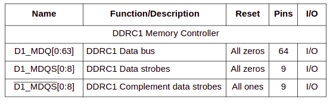
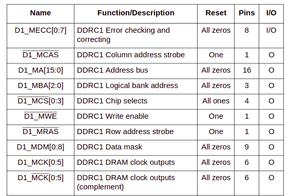
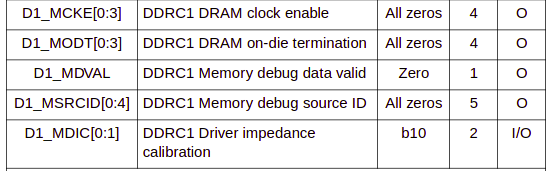
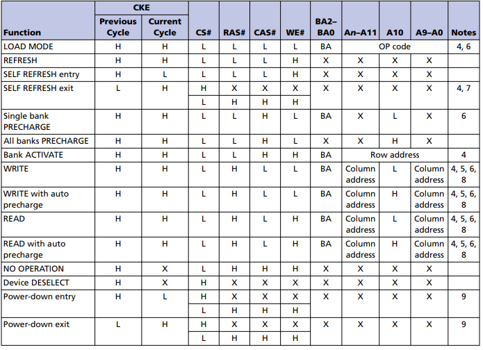
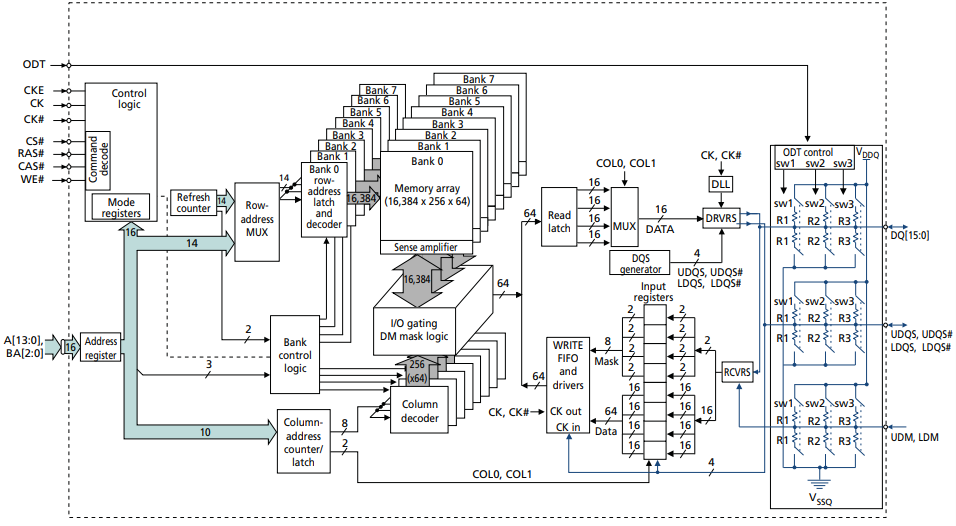
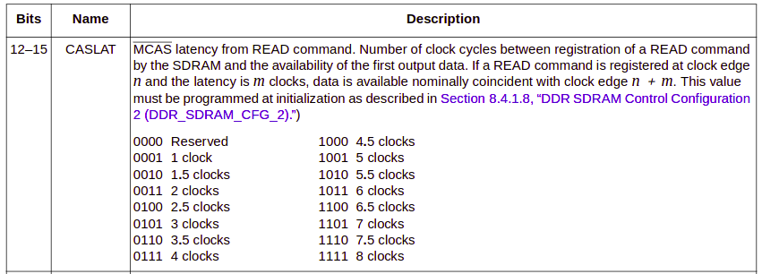

## About ddr in 8641 soc

some variants of 8641 soc

* 8641 one e600 core

* 8641d two e600 core
* two seperate ddr sdram controller


## The signals of DDR SDRAM controller



DQ为ddr数据信号，DQS为ddr数据信号的"时钟"



MA为地址信号，BA为bank地址信号，CAS/RAS为地址信号的"时钟"，CS为片选，CK为差分时钟信号。该ddr控制器总共4根片选，可以接4片ddr内存。DM为数据mask信号，对于x16接口，高低字节都需要一个DM信号。



CKE为时钟使能信号，ODT为终端电阻控制信号。

信号总共分为几类

* data bus

* data clock

* address bus

* address clock

* control&debug

## The timing settings of ddr controller

timing参数设置是由ddr控制器通过[JEDEC](https://www.jedec.org/)标准定义的命令经过内存访问时序发给内存芯片的。ddr控制器和ddr芯片间通过jedec命令交互。试想一下如果没有jedec标准，每个内存芯片商按照自己的标准生产芯片，对于ddr controller厂商的实现将不会通用，必然导致增加研发成本，所以说标准化是一个很厉害的东西，尤其是各行业的标准都是技术大厂主导的。



对于BSP来讲，对ddr芯片参数的设置就转换成对ddr controller的参数进行设置。一般SOC都会以内存映射的方式映射ddr controller的控制寄存器到系统空间，这样CPU就可以配置这些参数了。

## CL setting

### CL for CAS Latency

CAS Latency是指内存存取数据所需的延迟时间，简单就是内存接到CPU的指令后的反应速度。

CAS Latency是指列地址选通脉冲时间延迟，控制着从收到命令到执行命令的间隔时间。
从CAS开始到CAS结束的时间就是现在讲的CAS延迟。CAS是内存寻址的最后一个步骤，在内存参数中最重要。

**CL is short for CAS Latency.**
CL数字越小，代表反应需要的时间越短。

### initialization code of u-boot

```
drivers/ddr/fsl/mpc86xx_ddr.c

```

两个ddr控制器

fsl_ddr_set_memctl_regs

### MT47H128M16RT-25EIT:C

根据手册
行地址14位，列地址10位，bank地址3位

总共16384*256*64*8 bits
    行    列  数据 bank数
=> 32M*64 = 2G bytes

每个ddr控制器总共4个片选信号，总共可以连接4片

目前连接一片ddr，根据硬件连接确定片选信号线。

所有上面的信息需要配置给ddr芯片，配置到ddr芯片是通过ddr控制器的寄存器操作完成的。



相关的寄存器设置见uboot代码
sbc8641d类似配置

```
include/configs/sbc8641d
CONFIG_SYS_DDR_TIMING_3
CONFIG_SYS_DDR_TIMING_0 
CONFIG_SYS_DDR_TIMING_1 0x38377322
CONFIG_SYS_DDR_TIMING_2
```

CONFIG_SYS_DDR_TIMING_1中12-15位配置CL参数可以按需修改。


## References

1、8641d芯片手册

2、内存芯片手册

3、uboot源码


