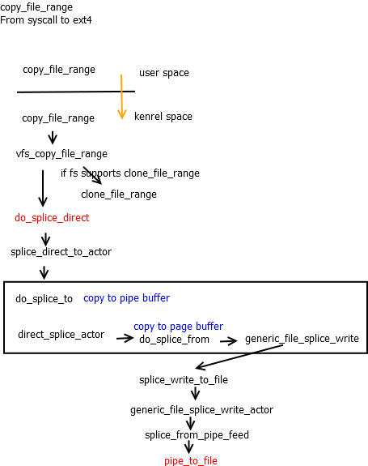
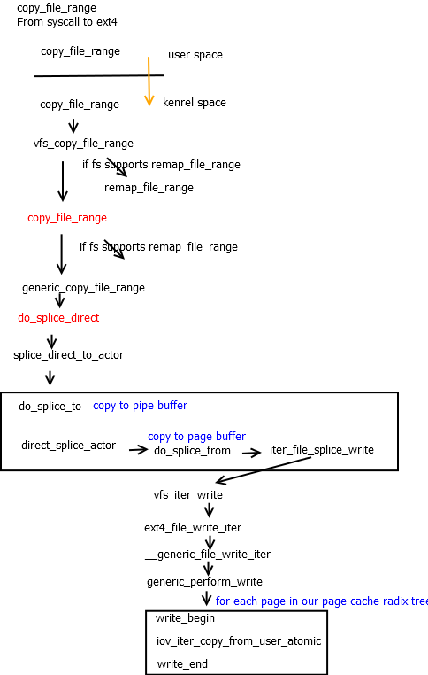
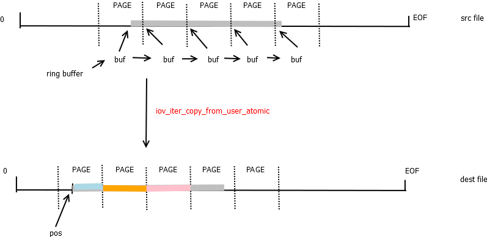

# copy_file_range问题
在使用3.10内核的过程中遇到一个关于copy_file_range的问题，**拷贝后数据不对**。有必要对这个系统调用分析一下。
# copy_file_range
**copy_file_range**是最近新增的[2]syscall，在不需要内核和用户态缓存间的拷贝就可以高效实现文件间的拷贝。传统的文件拷贝流程涉及内核page cache到用户缓存，然后由用户缓存再拷贝到内核page cache，中间涉及两次拷贝，效率不高。copy_file_range正是对拷贝的优化，内部实现是通过pipe buffer的结构，在读取源文件时把涉及到的page cache内存页，页内offset，长度信息，保存到pipe buffer中，在向目标文件拷贝时直接读取pipe buffer信息，执行后续写操作，这样仅需要一次拷贝就完成了。

copy_file_range的流程图如下

可以看到最终调用pipe_to_file。下面看下该函数的实现。
```c
int pipe_to_file(struct pipe_inode_info *pipe, struct pipe_buffer *buf,
struct splice_desc *sd)
{
	struct file *file = sd->u.file;
	struct address_space *mapping = file->f_mapping;
	unsigned int offset, this_len;
	struct page *page;
	void *fsdata;
	int ret;

	offset = sd->pos & ~PAGE_CACHE_MASK;

	this_len = sd->len;
	if (this_len + offset > PAGE_CACHE_SIZE)
		this_len = PAGE_CACHE_SIZE - offset;

	ret = pagecache_write_begin(file, mapping, sd->pos, this_len,
	AOP_FLAG_UNINTERRUPTIBLE, &page, &fsdata);
	if (unlikely(ret))
		goto out;

	if (buf->page != page) {
		char *src = buf->ops->map(pipe, buf, 1);
		char *dst = kmap_atomic(page);

		memcpy(dst + offset, src + buf->offset, this_len);
		flush_dcache_page(page);
		kunmap_atomic(dst);
		buf->ops->unmap(pipe, buf, src);
	}
	ret = pagecache_write_end(file, mapping, sd->pos, this_len, this_len,
		page, fsdata);
out:
	return ret;
}
```
上面第22行判断如果不是同一page时才会执行数据拷贝操作，如果是同一page，则不执行数据操作。这样copy_file_range就不适用同一文件中拷贝。如果执行copy\_file\_range测试指定的是同一文件，在源偏移和目标偏移很小，即小于一个page大小时，pipe_to_file就不执行数据操作，从而导致拷贝数据不一致。

内核upstream上的处理流程如下图:

>最新版的内核已经抛弃对pipe_to_file的调用，该函数也已经从内核移除。最终的实现调用的是iov_iter_copy_from_user_atomic负责完成数据操作。

```
size_t iov_iter_copy_from_user_atomic(struct page *page,
struct iov_iter *i, unsigned long offset, size_t bytes)
{
	char *kaddr = kmap_atomic(page), *p = kaddr + offset;
	if (unlikely(!page_copy_sane(page, offset, bytes))) {
		kunmap_atomic(kaddr);
		return 0;
	}
	if (unlikely(iov_iter_is_pipe(i) || iov_iter_is_discard(i))) {
		kunmap_atomic(kaddr);
		WARN_ON(1);
		return 0;
	}
	iterate_all_kinds(i, bytes, v,
		copyin((p += v.iov_len) - v.iov_len, v.iov_base, v.iov_len),
		memcpy_from_page((p += v.bv_len) - v.bv_len, v.bv_page,v.bv_offset, v.bv_len),
		memcpy((p += v.iov_len) - v.iov_len, v.iov_base, v.iov_len)
	)
	kunmap_atomic(kaddr);
	return bytes;
}
EXPORT_SYMBOL(iov_iter_copy_from_user_atomic);
```
iov_iter_copy_from_user_atomic的流程图:

>iov_iter_copy_from_user_atomic函数并不关心源和目标page是否是同一page，他们之间是否会出现覆盖的情>况，仅仅是执行数据操作。如果数据源和数据目标有覆盖则copy_file_range的结果是有问题的。

数据覆盖的情况如下图:

# 结论
在使用copy_file_range时一定要注意针对同一文件执行copy_file_range，结果有可能发生覆盖，导致结果并不是我们预期的。这个和memcpy一样，在有覆盖时结果时不可预期的。

# 参考
1. [copy_file_range()](https://lwn.net/Articles/659523/)
2. [read_write.c](https://git.kernel.org/pub/scm/linux/kernel/git/torvalds/linux.git/tree/fs/read_write.c)
