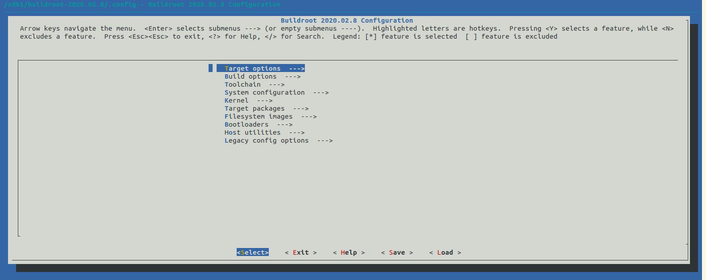
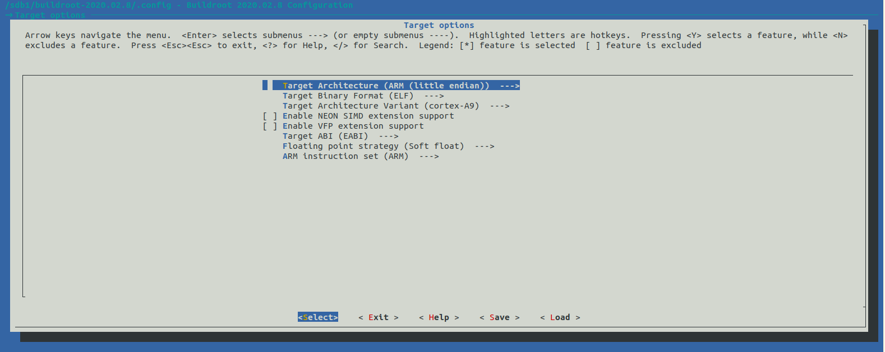
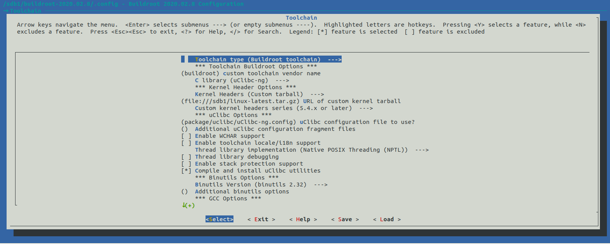

## Preparation

```shell
sudo apt install gcc-arm-linux-gnueabi
```

```
su@ubuntu2004:/sdb1/buildroot-2020.02.8$ dpkg -l | grep armel
ii  cpp-arm-linux-gnueabi                      4:9.3.0-1ubuntu2                      amd64        GNU C preprocessor (cpp) for the armel architecture
ii  gcc-9-arm-linux-gnueabi                    9.3.0-17ubuntu1~20.04cross2           amd64        GNU C compiler (cross compiler for armel architecture)
ii  gcc-arm-linux-gnueabi                      4:9.3.0-1ubuntu2                      amd64        GNU C compiler for the armel architecture
ii  libasan5-armel-cross                       9.3.0-17ubuntu1~20.04cross2           all          AddressSanitizer -- a fast memory error detector
ii  libatomic1-armel-cross                     10.2.0-5ubuntu1~20.04cross1           all          support library providing __atomic built-in functions
ii  libc6-armel-cross                          2.31-0ubuntu7cross1                   all          GNU C Library: Shared libraries (for cross-compiling)
ii  libc6-dev-armel-cross                      2.31-0ubuntu7cross1                   all          GNU C Library: Development Libraries and Header Files (for cross-compiling)
ii  libgcc-9-dev-armel-cross                   9.3.0-17ubuntu1~20.04cross2           all          GCC support library (development files)
ii  libgcc-s1-armel-cross                      10.2.0-5ubuntu1~20.04cross1           all          GCC support library (armel)
ii  libgomp1-armel-cross                       10.2.0-5ubuntu1~20.04cross1           all          GCC OpenMP (GOMP) support library
ii  libstdc++6-armel-cross                     10.2.0-5ubuntu1~20.04cross1           all          GNU Standard C++ Library v3 (armel)
ii  libubsan1-armel-cross                      10.2.0-5ubuntu1~20.04cross1           all          UBSan -- undefined behaviour sanitizer (runtime)
ii  linux-libc-dev-armel-cross                 5.4.0-21.25cross1                     all          Linux Kernel Headers for development (for cross-compiling)

```

```
su@ubuntu2004:/sdb1/buildroot-2020.02.8$ dpkg -l linux-libc-dev-armel-cross
Desired=Unknown/Install/Remove/Purge/Hold
| Status=Not/Inst/Conf-files/Unpacked/halF-conf/Half-inst/trig-aWait/Trig-pend
|/ Err?=(none)/Reinst-required (Status,Err: uppercase=bad)
||/ Name                       Version           Architecture Description
+++-==========================-=================-============-==========================================================
ii  linux-libc-dev-armel-cross 5.4.0-21.25cross1 all          Linux Kernel Headers for development (for cross-compiling)
```

```
su@ubuntu2004:/sdb1/buildroot-2020.02.8$ dpkg -L libc6-armel-cross
/.
/usr
/usr/arm-linux-gnueabi
/usr/arm-linux-gnueabi/lib
/usr/arm-linux-gnueabi/lib/ld-2.31.so
/usr/arm-linux-gnueabi/lib/libBrokenLocale-2.31.so
/usr/arm-linux-gnueabi/lib/libSegFault.so
/usr/arm-linux-gnueabi/lib/libanl-2.31.so
/usr/arm-linux-gnueabi/lib/libc-2.31.so
/usr/arm-linux-gnueabi/lib/libdl-2.31.so
/usr/arm-linux-gnueabi/lib/libm-2.31.so
/usr/arm-linux-gnueabi/lib/libmemusage.so
/usr/arm-linux-gnueabi/lib/libnsl-2.31.so
/usr/arm-linux-gnueabi/lib/libnss_compat-2.31.so
/usr/arm-linux-gnueabi/lib/libnss_dns-2.31.so
/usr/arm-linux-gnueabi/lib/libnss_files-2.31.so
/usr/arm-linux-gnueabi/lib/libnss_hesiod-2.31.so
/usr/arm-linux-gnueabi/lib/libnss_nis-2.31.so
/usr/arm-linux-gnueabi/lib/libnss_nisplus-2.31.so
/usr/arm-linux-gnueabi/lib/libpcprofile.so
/usr/arm-linux-gnueabi/lib/libpthread-2.31.so
/usr/arm-linux-gnueabi/lib/libresolv-2.31.so
/usr/arm-linux-gnueabi/lib/librt-2.31.so
/usr/arm-linux-gnueabi/lib/libthread_db-1.0.so
/usr/arm-linux-gnueabi/lib/libutil-2.31.so
/usr/arm-linux-gnueabihf
/usr/arm-linux-gnueabihf/lib
/usr/arm-linux-gnueabihf/libsf
/usr/share
/usr/share/doc
/usr/share/doc/libc6-armel-cross
/usr/share/doc/libc6-armel-cross/README
/usr/share/doc/libc6-armel-cross/changelog.Debian.gz
/usr/share/doc/libc6-armel-cross/changelog.gz
/usr/share/doc/libc6-armel-cross/copyright
/usr/share/lintian
/usr/share/lintian/overrides
/usr/share/lintian/overrides/libc6-armel-cross
/usr/arm-linux-gnueabi/lib/ld-linux.so.3
/usr/arm-linux-gnueabi/lib/libBrokenLocale.so.1
/usr/arm-linux-gnueabi/lib/libanl.so.1
/usr/arm-linux-gnueabi/lib/libc.so.6
/usr/arm-linux-gnueabi/lib/libdl.so.2
/usr/arm-linux-gnueabi/lib/libm.so.6
/usr/arm-linux-gnueabi/lib/libnsl.so.1
/usr/arm-linux-gnueabi/lib/libnss_compat.so.2
/usr/arm-linux-gnueabi/lib/libnss_dns.so.2
/usr/arm-linux-gnueabi/lib/libnss_files.so.2
/usr/arm-linux-gnueabi/lib/libnss_hesiod.so.2
/usr/arm-linux-gnueabi/lib/libnss_nis.so.2
/usr/arm-linux-gnueabi/lib/libnss_nisplus.so.2
/usr/arm-linux-gnueabi/lib/libpthread.so.0
/usr/arm-linux-gnueabi/lib/libresolv.so.2
/usr/arm-linux-gnueabi/lib/librt.so.1
/usr/arm-linux-gnueabi/lib/libthread_db.so.1
/usr/arm-linux-gnueabi/lib/libutil.so.1
/usr/arm-linux-gnueabihf/lib/sf
/usr/arm-linux-gnueabihf/libsf/ld-2.31.so
/usr/arm-linux-gnueabihf/libsf/ld-linux.so.3
/usr/arm-linux-gnueabihf/libsf/libBrokenLocale-2.31.so
/usr/arm-linux-gnueabihf/libsf/libBrokenLocale.so.1
/usr/arm-linux-gnueabihf/libsf/libSegFault.so
/usr/arm-linux-gnueabihf/libsf/libanl-2.31.so
/usr/arm-linux-gnueabihf/libsf/libanl.so.1
/usr/arm-linux-gnueabihf/libsf/libc-2.31.so
/usr/arm-linux-gnueabihf/libsf/libc.so.6
/usr/arm-linux-gnueabihf/libsf/libdl-2.31.so
/usr/arm-linux-gnueabihf/libsf/libdl.so.2
/usr/arm-linux-gnueabihf/libsf/libm-2.31.so
/usr/arm-linux-gnueabihf/libsf/libm.so.6
/usr/arm-linux-gnueabihf/libsf/libmemusage.so
/usr/arm-linux-gnueabihf/libsf/libnsl-2.31.so
/usr/arm-linux-gnueabihf/libsf/libnsl.so.1
/usr/arm-linux-gnueabihf/libsf/libnss_compat-2.31.so
/usr/arm-linux-gnueabihf/libsf/libnss_compat.so.2
/usr/arm-linux-gnueabihf/libsf/libnss_dns-2.31.so
/usr/arm-linux-gnueabihf/libsf/libnss_dns.so.2
/usr/arm-linux-gnueabihf/libsf/libnss_files-2.31.so
/usr/arm-linux-gnueabihf/libsf/libnss_files.so.2
/usr/arm-linux-gnueabihf/libsf/libnss_hesiod-2.31.so
/usr/arm-linux-gnueabihf/libsf/libnss_hesiod.so.2
/usr/arm-linux-gnueabihf/libsf/libnss_nis-2.31.so
/usr/arm-linux-gnueabihf/libsf/libnss_nis.so.2
/usr/arm-linux-gnueabihf/libsf/libnss_nisplus-2.31.so
/usr/arm-linux-gnueabihf/libsf/libnss_nisplus.so.2
/usr/arm-linux-gnueabihf/libsf/libpcprofile.so
/usr/arm-linux-gnueabihf/libsf/libpthread-2.31.so
/usr/arm-linux-gnueabihf/libsf/libpthread.so.0
/usr/arm-linux-gnueabihf/libsf/libresolv-2.31.so
/usr/arm-linux-gnueabihf/libsf/libresolv.so.2
/usr/arm-linux-gnueabihf/libsf/librt-2.31.so
/usr/arm-linux-gnueabihf/libsf/librt.so.1
/usr/arm-linux-gnueabihf/libsf/libthread_db-1.0.so
/usr/arm-linux-gnueabihf/libsf/libthread_db.so.1
/usr/arm-linux-gnueabihf/libsf/libutil-2.31.so
/usr/arm-linux-gnueabihf/libsf/libutil.so.1
```

```
su@ubuntu2004:/sdb1/buildroot-2020.02.8$ dpkg -L libc6-dev-armel-cross
/.
/usr
/usr/arm-linux-gnueabi
/usr/arm-linux-gnueabi/include
/usr/arm-linux-gnueabi/include/a.out.h
/usr/arm-linux-gnueabi/include/aio.h
/usr/arm-linux-gnueabi/include/aliases.h
/usr/arm-linux-gnueabi/include/alloca.h
/usr/arm-linux-gnueabi/include/ar.h
/usr/arm-linux-gnueabi/include/argp.h
/usr/arm-linux-gnueabi/include/argz.h
/usr/arm-linux-gnueabi/include/arpa
/usr/arm-linux-gnueabi/include/arpa/ftp.h
/usr/arm-linux-gnueabi/include/arpa/inet.h
/usr/arm-linux-gnueabi/include/arpa/nameser.h
/usr/arm-linux-gnueabi/include/arpa/nameser_compat.h
/usr/arm-linux-gnueabi/include/arpa/telnet.h
/usr/arm-linux-gnueabi/include/arpa/tftp.h
/usr/arm-linux-gnueabi/include/assert.h
/usr/arm-linux-gnueabi/include/bits
/usr/arm-linux-gnueabi/include/bits/a.out.h
/usr/arm-linux-gnueabi/include/bits/argp-ldbl.h
/usr/arm-linux-gnueabi/include/bits/auxv.h
/usr/arm-linux-gnueabi/include/bits/byteswap.h
/usr/arm-linux-gnueabi/include/bits/cmathcalls.h
/usr/arm-linux-gnueabi/include/bits/confname.h
/usr/arm-linux-gnueabi/include/bits/cpu-set.h
/usr/arm-linux-gnueabi/include/bits/dirent.h
/usr/arm-linux-gnueabi/include/bits/dirent_ext.h
/usr/arm-linux-gnueabi/include/bits/dlfcn.h
/usr/arm-linux-gnueabi/include/bits/elfclass.h
/usr/arm-linux-gnueabi/include/bits/endian.h
/usr/arm-linux-gnueabi/include/bits/endianness.h
/usr/arm-linux-gnueabi/include/bits/environments.h
/usr/arm-linux-gnueabi/include/bits/epoll.h
/usr/arm-linux-gnueabi/include/bits/err-ldbl.h
/usr/arm-linux-gnueabi/include/bits/errno.h
/usr/arm-linux-gnueabi/include/bits/error-ldbl.h
/usr/arm-linux-gnueabi/include/bits/error.h
/usr/arm-linux-gnueabi/include/bits/eventfd.h
/usr/arm-linux-gnueabi/include/bits/fcntl-linux.h
/usr/arm-linux-gnueabi/include/bits/fcntl.h
/usr/arm-linux-gnueabi/include/bits/fcntl2.h
/usr/arm-linux-gnueabi/include/bits/fenv.h
/usr/arm-linux-gnueabi/include/bits/fenvinline.h
/usr/arm-linux-gnueabi/include/bits/floatn-common.h
/usr/arm-linux-gnueabi/include/bits/floatn.h
/usr/arm-linux-gnueabi/include/bits/flt-eval-method.h
/usr/arm-linux-gnueabi/include/bits/fp-fast.h
/usr/arm-linux-gnueabi/include/bits/fp-logb.h
/usr/arm-linux-gnueabi/include/bits/getopt_core.h
/usr/arm-linux-gnueabi/include/bits/getopt_ext.h
/usr/arm-linux-gnueabi/include/bits/getopt_posix.h
/usr/arm-linux-gnueabi/include/bits/hwcap.h
/usr/arm-linux-gnueabi/include/bits/in.h
/usr/arm-linux-gnueabi/include/bits/indirect-return.h
/usr/arm-linux-gnueabi/include/bits/initspin.h
/usr/arm-linux-gnueabi/include/bits/inotify.h
/usr/arm-linux-gnueabi/include/bits/ioctl-types.h
/usr/arm-linux-gnueabi/include/bits/ioctls.h
/usr/arm-linux-gnueabi/include/bits/ipc-perm.h
/usr/arm-linux-gnueabi/include/bits/ipc.h
/usr/arm-linux-gnueabi/include/bits/ipctypes.h
/usr/arm-linux-gnueabi/include/bits/iscanonical.h
/usr/arm-linux-gnueabi/include/bits/libc-header-start.h
/usr/arm-linux-gnueabi/include/bits/libm-simd-decl-stubs.h
/usr/arm-linux-gnueabi/include/bits/link.h
/usr/arm-linux-gnueabi/include/bits/local_lim.h
/usr/arm-linux-gnueabi/include/bits/locale.h
/usr/arm-linux-gnueabi/include/bits/long-double.h
/usr/arm-linux-gnueabi/include/bits/math-vector.h
/usr/arm-linux-gnueabi/include/bits/mathcalls-helper-functions.h
/usr/arm-linux-gnueabi/include/bits/mathcalls-narrow.h
/usr/arm-linux-gnueabi/include/bits/mathcalls.h
/usr/arm-linux-gnueabi/include/bits/mathdef.h
/usr/arm-linux-gnueabi/include/bits/mathinline.h
/usr/arm-linux-gnueabi/include/bits/mman-linux.h
/usr/arm-linux-gnueabi/include/bits/mman-map-flags-generic.h
/usr/arm-linux-gnueabi/include/bits/mman-shared.h
/usr/arm-linux-gnueabi/include/bits/mman.h
/usr/arm-linux-gnueabi/include/bits/monetary-ldbl.h
/usr/arm-linux-gnueabi/include/bits/mqueue.h
/usr/arm-linux-gnueabi/include/bits/mqueue2.h
/usr/arm-linux-gnueabi/include/bits/msq-pad.h
/usr/arm-linux-gnueabi/include/bits/msq.h
/usr/arm-linux-gnueabi/include/bits/netdb.h
/usr/arm-linux-gnueabi/include/bits/param.h
/usr/arm-linux-gnueabi/include/bits/poll.h
/usr/arm-linux-gnueabi/include/bits/poll2.h
/usr/arm-linux-gnueabi/include/bits/posix1_lim.h
/usr/arm-linux-gnueabi/include/bits/posix2_lim.h
/usr/arm-linux-gnueabi/include/bits/posix_opt.h
/usr/arm-linux-gnueabi/include/bits/printf-ldbl.h
/usr/arm-linux-gnueabi/include/bits/procfs-extra.h
/usr/arm-linux-gnueabi/include/bits/procfs-id.h
/usr/arm-linux-gnueabi/include/bits/procfs-prregset.h
/usr/arm-linux-gnueabi/include/bits/procfs.h
/usr/arm-linux-gnueabi/include/bits/pthreadtypes-arch.h
/usr/arm-linux-gnueabi/include/bits/pthreadtypes.h
/usr/arm-linux-gnueabi/include/bits/ptrace-shared.h
/usr/arm-linux-gnueabi/include/bits/resource.h
/usr/arm-linux-gnueabi/include/bits/sched.h
/usr/arm-linux-gnueabi/include/bits/select.h
/usr/arm-linux-gnueabi/include/bits/select2.h
/usr/arm-linux-gnueabi/include/bits/sem-pad.h
/usr/arm-linux-gnueabi/include/bits/sem.h
/usr/arm-linux-gnueabi/include/bits/semaphore.h
/usr/arm-linux-gnueabi/include/bits/setjmp.h
/usr/arm-linux-gnueabi/include/bits/setjmp2.h
/usr/arm-linux-gnueabi/include/bits/shm-pad.h
/usr/arm-linux-gnueabi/include/bits/shm.h
/usr/arm-linux-gnueabi/include/bits/shmlba.h
/usr/arm-linux-gnueabi/include/bits/sigaction.h
/usr/arm-linux-gnueabi/include/bits/sigcontext.h
/usr/arm-linux-gnueabi/include/bits/sigevent-consts.h
/usr/arm-linux-gnueabi/include/bits/siginfo-arch.h
/usr/arm-linux-gnueabi/include/bits/siginfo-consts-arch.h
/usr/arm-linux-gnueabi/include/bits/siginfo-consts.h
/usr/arm-linux-gnueabi/include/bits/signal_ext.h
/usr/arm-linux-gnueabi/include/bits/signalfd.h
/usr/arm-linux-gnueabi/include/bits/signum-generic.h
/usr/arm-linux-gnueabi/include/bits/signum.h
/usr/arm-linux-gnueabi/include/bits/sigstack.h
/usr/arm-linux-gnueabi/include/bits/sigthread.h
/usr/arm-linux-gnueabi/include/bits/sockaddr.h
/usr/arm-linux-gnueabi/include/bits/socket-constants.h
/usr/arm-linux-gnueabi/include/bits/socket.h
/usr/arm-linux-gnueabi/include/bits/socket2.h
/usr/arm-linux-gnueabi/include/bits/socket_type.h
/usr/arm-linux-gnueabi/include/bits/ss_flags.h
/usr/arm-linux-gnueabi/include/bits/stab.def
/usr/arm-linux-gnueabi/include/bits/stat.h
/usr/arm-linux-gnueabi/include/bits/statfs.h
/usr/arm-linux-gnueabi/include/bits/statvfs.h
/usr/arm-linux-gnueabi/include/bits/statx-generic.h
/usr/arm-linux-gnueabi/include/bits/statx.h
/usr/arm-linux-gnueabi/include/bits/stdint-intn.h
/usr/arm-linux-gnueabi/include/bits/stdint-uintn.h
/usr/arm-linux-gnueabi/include/bits/stdio-ldbl.h
/usr/arm-linux-gnueabi/include/bits/stdio.h
/usr/arm-linux-gnueabi/include/bits/stdio2.h
/usr/arm-linux-gnueabi/include/bits/stdio_lim.h
/usr/arm-linux-gnueabi/include/bits/stdlib-bsearch.h
/usr/arm-linux-gnueabi/include/bits/stdlib-float.h
/usr/arm-linux-gnueabi/include/bits/stdlib-ldbl.h
/usr/arm-linux-gnueabi/include/bits/stdlib.h
/usr/arm-linux-gnueabi/include/bits/string_fortified.h
/usr/arm-linux-gnueabi/include/bits/strings_fortified.h
/usr/arm-linux-gnueabi/include/bits/struct_mutex.h
/usr/arm-linux-gnueabi/include/bits/struct_rwlock.h
/usr/arm-linux-gnueabi/include/bits/sys_errlist.h
/usr/arm-linux-gnueabi/include/bits/syscall.h
/usr/arm-linux-gnueabi/include/bits/sysctl.h
/usr/arm-linux-gnueabi/include/bits/syslog-ldbl.h
/usr/arm-linux-gnueabi/include/bits/syslog-path.h
/usr/arm-linux-gnueabi/include/bits/syslog.h
/usr/arm-linux-gnueabi/include/bits/sysmacros.h
/usr/arm-linux-gnueabi/include/bits/termios-baud.h
/usr/arm-linux-gnueabi/include/bits/termios-c_cc.h
/usr/arm-linux-gnueabi/include/bits/termios-c_cflag.h
/usr/arm-linux-gnueabi/include/bits/termios-c_iflag.h
/usr/arm-linux-gnueabi/include/bits/termios-c_lflag.h
/usr/arm-linux-gnueabi/include/bits/termios-c_oflag.h
/usr/arm-linux-gnueabi/include/bits/termios-misc.h
/usr/arm-linux-gnueabi/include/bits/termios-struct.h
/usr/arm-linux-gnueabi/include/bits/termios-tcflow.h
/usr/arm-linux-gnueabi/include/bits/termios.h
/usr/arm-linux-gnueabi/include/bits/thread-shared-types.h
/usr/arm-linux-gnueabi/include/bits/time.h
/usr/arm-linux-gnueabi/include/bits/time64.h
/usr/arm-linux-gnueabi/include/bits/timerfd.h
/usr/arm-linux-gnueabi/include/bits/timesize.h
/usr/arm-linux-gnueabi/include/bits/timex.h
/usr/arm-linux-gnueabi/include/bits/types
/usr/arm-linux-gnueabi/include/bits/types/FILE.h
/usr/arm-linux-gnueabi/include/bits/types/__FILE.h
/usr/arm-linux-gnueabi/include/bits/types/__fpos64_t.h
/usr/arm-linux-gnueabi/include/bits/types/__fpos_t.h
/usr/arm-linux-gnueabi/include/bits/types/__locale_t.h
/usr/arm-linux-gnueabi/include/bits/types/__mbstate_t.h
/usr/arm-linux-gnueabi/include/bits/types/__sigset_t.h
/usr/arm-linux-gnueabi/include/bits/types/__sigval_t.h
/usr/arm-linux-gnueabi/include/bits/types/clock_t.h
/usr/arm-linux-gnueabi/include/bits/types/clockid_t.h
/usr/arm-linux-gnueabi/include/bits/types/cookie_io_functions_t.h
/usr/arm-linux-gnueabi/include/bits/types/error_t.h
/usr/arm-linux-gnueabi/include/bits/types/locale_t.h
/usr/arm-linux-gnueabi/include/bits/types/mbstate_t.h
/usr/arm-linux-gnueabi/include/bits/types/res_state.h
/usr/arm-linux-gnueabi/include/bits/types/sig_atomic_t.h
/usr/arm-linux-gnueabi/include/bits/types/sigevent_t.h
/usr/arm-linux-gnueabi/include/bits/types/siginfo_t.h
/usr/arm-linux-gnueabi/include/bits/types/sigset_t.h
/usr/arm-linux-gnueabi/include/bits/types/sigval_t.h
/usr/arm-linux-gnueabi/include/bits/types/stack_t.h
/usr/arm-linux-gnueabi/include/bits/types/struct_FILE.h
/usr/arm-linux-gnueabi/include/bits/types/struct_iovec.h
/usr/arm-linux-gnueabi/include/bits/types/struct_itimerspec.h
/usr/arm-linux-gnueabi/include/bits/types/struct_osockaddr.h
/usr/arm-linux-gnueabi/include/bits/types/struct_rusage.h
/usr/arm-linux-gnueabi/include/bits/types/struct_sched_param.h
/usr/arm-linux-gnueabi/include/bits/types/struct_sigstack.h
/usr/arm-linux-gnueabi/include/bits/types/struct_statx.h
/usr/arm-linux-gnueabi/include/bits/types/struct_statx_timestamp.h
/usr/arm-linux-gnueabi/include/bits/types/struct_timespec.h
/usr/arm-linux-gnueabi/include/bits/types/struct_timeval.h
/usr/arm-linux-gnueabi/include/bits/types/struct_tm.h
/usr/arm-linux-gnueabi/include/bits/types/time_t.h
/usr/arm-linux-gnueabi/include/bits/types/timer_t.h
/usr/arm-linux-gnueabi/include/bits/types/wint_t.h
/usr/arm-linux-gnueabi/include/bits/types.h
/usr/arm-linux-gnueabi/include/bits/typesizes.h
/usr/arm-linux-gnueabi/include/bits/uintn-identity.h
/usr/arm-linux-gnueabi/include/bits/uio-ext.h
/usr/arm-linux-gnueabi/include/bits/uio_lim.h
/usr/arm-linux-gnueabi/include/bits/unistd.h
/usr/arm-linux-gnueabi/include/bits/unistd_ext.h
/usr/arm-linux-gnueabi/include/bits/utmp.h
/usr/arm-linux-gnueabi/include/bits/utmpx.h
/usr/arm-linux-gnueabi/include/bits/utsname.h
/usr/arm-linux-gnueabi/include/bits/waitflags.h
/usr/arm-linux-gnueabi/include/bits/waitstatus.h
/usr/arm-linux-gnueabi/include/bits/wchar-ldbl.h
/usr/arm-linux-gnueabi/include/bits/wchar.h
/usr/arm-linux-gnueabi/include/bits/wchar2.h
/usr/arm-linux-gnueabi/include/bits/wctype-wchar.h
/usr/arm-linux-gnueabi/include/bits/wordsize.h
/usr/arm-linux-gnueabi/include/bits/xopen_lim.h
/usr/arm-linux-gnueabi/include/byteswap.h
/usr/arm-linux-gnueabi/include/complex.h
/usr/arm-linux-gnueabi/include/cpio.h
/usr/arm-linux-gnueabi/include/ctype.h
/usr/arm-linux-gnueabi/include/dirent.h
/usr/arm-linux-gnueabi/include/dlfcn.h
/usr/arm-linux-gnueabi/include/elf.h
/usr/arm-linux-gnueabi/include/endian.h
/usr/arm-linux-gnueabi/include/envz.h
/usr/arm-linux-gnueabi/include/err.h
/usr/arm-linux-gnueabi/include/errno.h
/usr/arm-linux-gnueabi/include/error.h
/usr/arm-linux-gnueabi/include/execinfo.h
/usr/arm-linux-gnueabi/include/fcntl.h
/usr/arm-linux-gnueabi/include/features.h
/usr/arm-linux-gnueabi/include/fenv.h
/usr/arm-linux-gnueabi/include/finclude
/usr/arm-linux-gnueabi/include/finclude/math-vector-fortran.h
/usr/arm-linux-gnueabi/include/fmtmsg.h
/usr/arm-linux-gnueabi/include/fnmatch.h
/usr/arm-linux-gnueabi/include/fpu_control.h
/usr/arm-linux-gnueabi/include/fstab.h
/usr/arm-linux-gnueabi/include/fts.h
/usr/arm-linux-gnueabi/include/ftw.h
/usr/arm-linux-gnueabi/include/gconv.h
/usr/arm-linux-gnueabi/include/getopt.h
/usr/arm-linux-gnueabi/include/glob.h
/usr/arm-linux-gnueabi/include/gnu
/usr/arm-linux-gnueabi/include/gnu/lib-names-soft.h
/usr/arm-linux-gnueabi/include/gnu/lib-names.h
/usr/arm-linux-gnueabi/include/gnu/libc-version.h
/usr/arm-linux-gnueabi/include/gnu/stubs-hard.h
/usr/arm-linux-gnueabi/include/gnu/stubs-soft.h
/usr/arm-linux-gnueabi/include/gnu/stubs.h
/usr/arm-linux-gnueabi/include/gnu-versions.h
/usr/arm-linux-gnueabi/include/grp.h
/usr/arm-linux-gnueabi/include/gshadow.h
/usr/arm-linux-gnueabi/include/iconv.h
/usr/arm-linux-gnueabi/include/ieee754.h
/usr/arm-linux-gnueabi/include/ifaddrs.h
/usr/arm-linux-gnueabi/include/inttypes.h
/usr/arm-linux-gnueabi/include/langinfo.h
/usr/arm-linux-gnueabi/include/lastlog.h
/usr/arm-linux-gnueabi/include/libgen.h
/usr/arm-linux-gnueabi/include/libintl.h
/usr/arm-linux-gnueabi/include/limits.h
/usr/arm-linux-gnueabi/include/link.h
/usr/arm-linux-gnueabi/include/locale.h
/usr/arm-linux-gnueabi/include/malloc.h
/usr/arm-linux-gnueabi/include/math.h
/usr/arm-linux-gnueabi/include/mcheck.h
/usr/arm-linux-gnueabi/include/memory.h
/usr/arm-linux-gnueabi/include/mntent.h
/usr/arm-linux-gnueabi/include/monetary.h
/usr/arm-linux-gnueabi/include/mqueue.h
/usr/arm-linux-gnueabi/include/net
/usr/arm-linux-gnueabi/include/net/ethernet.h
/usr/arm-linux-gnueabi/include/net/if.h
/usr/arm-linux-gnueabi/include/net/if_arp.h
/usr/arm-linux-gnueabi/include/net/if_packet.h
/usr/arm-linux-gnueabi/include/net/if_ppp.h
/usr/arm-linux-gnueabi/include/net/if_shaper.h
/usr/arm-linux-gnueabi/include/net/if_slip.h
/usr/arm-linux-gnueabi/include/net/ppp-comp.h
/usr/arm-linux-gnueabi/include/net/ppp_defs.h
/usr/arm-linux-gnueabi/include/net/route.h
/usr/arm-linux-gnueabi/include/netash
/usr/arm-linux-gnueabi/include/netash/ash.h
/usr/arm-linux-gnueabi/include/netatalk
/usr/arm-linux-gnueabi/include/netatalk/at.h
/usr/arm-linux-gnueabi/include/netax25
/usr/arm-linux-gnueabi/include/netax25/ax25.h
/usr/arm-linux-gnueabi/include/netdb.h
/usr/arm-linux-gnueabi/include/neteconet
/usr/arm-linux-gnueabi/include/neteconet/ec.h
/usr/arm-linux-gnueabi/include/netinet
/usr/arm-linux-gnueabi/include/netinet/ether.h
/usr/arm-linux-gnueabi/include/netinet/icmp6.h
/usr/arm-linux-gnueabi/include/netinet/if_ether.h
/usr/arm-linux-gnueabi/include/netinet/if_fddi.h
/usr/arm-linux-gnueabi/include/netinet/if_tr.h
/usr/arm-linux-gnueabi/include/netinet/igmp.h
/usr/arm-linux-gnueabi/include/netinet/in.h
/usr/arm-linux-gnueabi/include/netinet/in_systm.h
/usr/arm-linux-gnueabi/include/netinet/ip.h
/usr/arm-linux-gnueabi/include/netinet/ip6.h
/usr/arm-linux-gnueabi/include/netinet/ip_icmp.h
/usr/arm-linux-gnueabi/include/netinet/tcp.h
/usr/arm-linux-gnueabi/include/netinet/udp.h
/usr/arm-linux-gnueabi/include/netipx
/usr/arm-linux-gnueabi/include/netipx/ipx.h
/usr/arm-linux-gnueabi/include/netiucv
/usr/arm-linux-gnueabi/include/netiucv/iucv.h
/usr/arm-linux-gnueabi/include/netpacket
/usr/arm-linux-gnueabi/include/netpacket/packet.h
/usr/arm-linux-gnueabi/include/netrom
/usr/arm-linux-gnueabi/include/netrom/netrom.h
/usr/arm-linux-gnueabi/include/netrose
/usr/arm-linux-gnueabi/include/netrose/rose.h
/usr/arm-linux-gnueabi/include/nfs
/usr/arm-linux-gnueabi/include/nfs/nfs.h
/usr/arm-linux-gnueabi/include/nl_types.h
/usr/arm-linux-gnueabi/include/nss.h
/usr/arm-linux-gnueabi/include/obstack.h
/usr/arm-linux-gnueabi/include/paths.h
/usr/arm-linux-gnueabi/include/poll.h
/usr/arm-linux-gnueabi/include/printf.h
/usr/arm-linux-gnueabi/include/proc_service.h
/usr/arm-linux-gnueabi/include/protocols
/usr/arm-linux-gnueabi/include/protocols/routed.h
/usr/arm-linux-gnueabi/include/protocols/rwhod.h
/usr/arm-linux-gnueabi/include/protocols/talkd.h
/usr/arm-linux-gnueabi/include/protocols/timed.h
/usr/arm-linux-gnueabi/include/pthread.h
/usr/arm-linux-gnueabi/include/pty.h
/usr/arm-linux-gnueabi/include/pwd.h
/usr/arm-linux-gnueabi/include/re_comp.h
/usr/arm-linux-gnueabi/include/regex.h
/usr/arm-linux-gnueabi/include/regexp.h
/usr/arm-linux-gnueabi/include/resolv.h
/usr/arm-linux-gnueabi/include/rpc
/usr/arm-linux-gnueabi/include/rpc/auth.h
/usr/arm-linux-gnueabi/include/rpc/auth_des.h
/usr/arm-linux-gnueabi/include/rpc/auth_unix.h
/usr/arm-linux-gnueabi/include/rpc/clnt.h
/usr/arm-linux-gnueabi/include/rpc/key_prot.h
/usr/arm-linux-gnueabi/include/rpc/netdb.h
/usr/arm-linux-gnueabi/include/rpc/pmap_clnt.h
/usr/arm-linux-gnueabi/include/rpc/pmap_prot.h
/usr/arm-linux-gnueabi/include/rpc/pmap_rmt.h
/usr/arm-linux-gnueabi/include/rpc/rpc.h
/usr/arm-linux-gnueabi/include/rpc/rpc_msg.h
/usr/arm-linux-gnueabi/include/rpc/svc.h
/usr/arm-linux-gnueabi/include/rpc/svc_auth.h
/usr/arm-linux-gnueabi/include/rpc/types.h
/usr/arm-linux-gnueabi/include/rpc/xdr.h
/usr/arm-linux-gnueabi/include/rpcsvc
/usr/arm-linux-gnueabi/include/rpcsvc/bootparam.h
/usr/arm-linux-gnueabi/include/rpcsvc/bootparam_prot.h
/usr/arm-linux-gnueabi/include/rpcsvc/bootparam_prot.x
/usr/arm-linux-gnueabi/include/rpcsvc/key_prot.h
/usr/arm-linux-gnueabi/include/rpcsvc/key_prot.x
/usr/arm-linux-gnueabi/include/rpcsvc/klm_prot.h
/usr/arm-linux-gnueabi/include/rpcsvc/klm_prot.x
/usr/arm-linux-gnueabi/include/rpcsvc/mount.h
/usr/arm-linux-gnueabi/include/rpcsvc/mount.x
/usr/arm-linux-gnueabi/include/rpcsvc/nfs_prot.h
/usr/arm-linux-gnueabi/include/rpcsvc/nfs_prot.x
/usr/arm-linux-gnueabi/include/rpcsvc/nis.h
/usr/arm-linux-gnueabi/include/rpcsvc/nis.x
/usr/arm-linux-gnueabi/include/rpcsvc/nis_callback.h
/usr/arm-linux-gnueabi/include/rpcsvc/nis_callback.x
/usr/arm-linux-gnueabi/include/rpcsvc/nis_object.x
/usr/arm-linux-gnueabi/include/rpcsvc/nis_tags.h
/usr/arm-linux-gnueabi/include/rpcsvc/nislib.h
/usr/arm-linux-gnueabi/include/rpcsvc/nlm_prot.h
/usr/arm-linux-gnueabi/include/rpcsvc/nlm_prot.x
/usr/arm-linux-gnueabi/include/rpcsvc/rex.h
/usr/arm-linux-gnueabi/include/rpcsvc/rex.x
/usr/arm-linux-gnueabi/include/rpcsvc/rquota.h
/usr/arm-linux-gnueabi/include/rpcsvc/rquota.x
/usr/arm-linux-gnueabi/include/rpcsvc/rstat.h
/usr/arm-linux-gnueabi/include/rpcsvc/rstat.x
/usr/arm-linux-gnueabi/include/rpcsvc/rusers.h
/usr/arm-linux-gnueabi/include/rpcsvc/rusers.x
/usr/arm-linux-gnueabi/include/rpcsvc/sm_inter.h
/usr/arm-linux-gnueabi/include/rpcsvc/sm_inter.x
/usr/arm-linux-gnueabi/include/rpcsvc/spray.h
/usr/arm-linux-gnueabi/include/rpcsvc/spray.x
/usr/arm-linux-gnueabi/include/rpcsvc/yp.h
/usr/arm-linux-gnueabi/include/rpcsvc/yp.x
/usr/arm-linux-gnueabi/include/rpcsvc/yp_prot.h
/usr/arm-linux-gnueabi/include/rpcsvc/ypclnt.h
/usr/arm-linux-gnueabi/include/rpcsvc/yppasswd.h
/usr/arm-linux-gnueabi/include/rpcsvc/yppasswd.x
/usr/arm-linux-gnueabi/include/rpcsvc/ypupd.h
/usr/arm-linux-gnueabi/include/sched.h
/usr/arm-linux-gnueabi/include/scsi
/usr/arm-linux-gnueabi/include/scsi/scsi.h
/usr/arm-linux-gnueabi/include/scsi/scsi_ioctl.h
/usr/arm-linux-gnueabi/include/scsi/sg.h
/usr/arm-linux-gnueabi/include/search.h
/usr/arm-linux-gnueabi/include/semaphore.h
/usr/arm-linux-gnueabi/include/setjmp.h
/usr/arm-linux-gnueabi/include/sgtty.h
/usr/arm-linux-gnueabi/include/shadow.h
/usr/arm-linux-gnueabi/include/signal.h
/usr/arm-linux-gnueabi/include/spawn.h
/usr/arm-linux-gnueabi/include/stab.h
/usr/arm-linux-gnueabi/include/stdc-predef.h
/usr/arm-linux-gnueabi/include/stdint.h
/usr/arm-linux-gnueabi/include/stdio.h
/usr/arm-linux-gnueabi/include/stdio_ext.h
/usr/arm-linux-gnueabi/include/stdlib.h
/usr/arm-linux-gnueabi/include/string.h
/usr/arm-linux-gnueabi/include/strings.h
/usr/arm-linux-gnueabi/include/sys
/usr/arm-linux-gnueabi/include/sys/acct.h
/usr/arm-linux-gnueabi/include/sys/auxv.h
/usr/arm-linux-gnueabi/include/sys/bitypes.h
/usr/arm-linux-gnueabi/include/sys/cdefs.h
/usr/arm-linux-gnueabi/include/sys/dir.h
/usr/arm-linux-gnueabi/include/sys/elf.h
/usr/arm-linux-gnueabi/include/sys/epoll.h
/usr/arm-linux-gnueabi/include/sys/errno.h
/usr/arm-linux-gnueabi/include/sys/eventfd.h
/usr/arm-linux-gnueabi/include/sys/fanotify.h
/usr/arm-linux-gnueabi/include/sys/fcntl.h
/usr/arm-linux-gnueabi/include/sys/file.h
/usr/arm-linux-gnueabi/include/sys/fsuid.h
/usr/arm-linux-gnueabi/include/sys/gmon.h
/usr/arm-linux-gnueabi/include/sys/gmon_out.h
/usr/arm-linux-gnueabi/include/sys/inotify.h
/usr/arm-linux-gnueabi/include/sys/ioctl.h
/usr/arm-linux-gnueabi/include/sys/ipc.h
/usr/arm-linux-gnueabi/include/sys/kd.h
/usr/arm-linux-gnueabi/include/sys/klog.h
/usr/arm-linux-gnueabi/include/sys/mman.h
/usr/arm-linux-gnueabi/include/sys/mount.h
/usr/arm-linux-gnueabi/include/sys/msg.h
/usr/arm-linux-gnueabi/include/sys/mtio.h
/usr/arm-linux-gnueabi/include/sys/param.h
/usr/arm-linux-gnueabi/include/sys/pci.h
/usr/arm-linux-gnueabi/include/sys/personality.h
/usr/arm-linux-gnueabi/include/sys/poll.h
/usr/arm-linux-gnueabi/include/sys/prctl.h
/usr/arm-linux-gnueabi/include/sys/procfs.h
/usr/arm-linux-gnueabi/include/sys/profil.h
/usr/arm-linux-gnueabi/include/sys/ptrace.h
/usr/arm-linux-gnueabi/include/sys/queue.h
/usr/arm-linux-gnueabi/include/sys/quota.h
/usr/arm-linux-gnueabi/include/sys/random.h
/usr/arm-linux-gnueabi/include/sys/raw.h
/usr/arm-linux-gnueabi/include/sys/reboot.h
/usr/arm-linux-gnueabi/include/sys/resource.h
/usr/arm-linux-gnueabi/include/sys/select.h
/usr/arm-linux-gnueabi/include/sys/sem.h
/usr/arm-linux-gnueabi/include/sys/sendfile.h
/usr/arm-linux-gnueabi/include/sys/shm.h
/usr/arm-linux-gnueabi/include/sys/signal.h
/usr/arm-linux-gnueabi/include/sys/signalfd.h
/usr/arm-linux-gnueabi/include/sys/socket.h
/usr/arm-linux-gnueabi/include/sys/socketvar.h
/usr/arm-linux-gnueabi/include/sys/soundcard.h
/usr/arm-linux-gnueabi/include/sys/stat.h
/usr/arm-linux-gnueabi/include/sys/statfs.h
/usr/arm-linux-gnueabi/include/sys/statvfs.h
/usr/arm-linux-gnueabi/include/sys/swap.h
/usr/arm-linux-gnueabi/include/sys/syscall.h
/usr/arm-linux-gnueabi/include/sys/sysctl.h
/usr/arm-linux-gnueabi/include/sys/sysinfo.h
/usr/arm-linux-gnueabi/include/sys/syslog.h
/usr/arm-linux-gnueabi/include/sys/sysmacros.h
/usr/arm-linux-gnueabi/include/sys/termios.h
/usr/arm-linux-gnueabi/include/sys/time.h
/usr/arm-linux-gnueabi/include/sys/timeb.h
/usr/arm-linux-gnueabi/include/sys/timerfd.h
/usr/arm-linux-gnueabi/include/sys/times.h
/usr/arm-linux-gnueabi/include/sys/timex.h
/usr/arm-linux-gnueabi/include/sys/ttychars.h
/usr/arm-linux-gnueabi/include/sys/ttydefaults.h
/usr/arm-linux-gnueabi/include/sys/types.h
/usr/arm-linux-gnueabi/include/sys/ucontext.h
/usr/arm-linux-gnueabi/include/sys/uio.h
/usr/arm-linux-gnueabi/include/sys/un.h
/usr/arm-linux-gnueabi/include/sys/unistd.h
/usr/arm-linux-gnueabi/include/sys/user.h
/usr/arm-linux-gnueabi/include/sys/utsname.h
/usr/arm-linux-gnueabi/include/sys/vfs.h
/usr/arm-linux-gnueabi/include/sys/vlimit.h
/usr/arm-linux-gnueabi/include/sys/vt.h
/usr/arm-linux-gnueabi/include/sys/vtimes.h
/usr/arm-linux-gnueabi/include/sys/wait.h
/usr/arm-linux-gnueabi/include/sys/xattr.h
/usr/arm-linux-gnueabi/include/syscall.h
/usr/arm-linux-gnueabi/include/sysexits.h
/usr/arm-linux-gnueabi/include/syslog.h
/usr/arm-linux-gnueabi/include/tar.h
/usr/arm-linux-gnueabi/include/termio.h
/usr/arm-linux-gnueabi/include/termios.h
/usr/arm-linux-gnueabi/include/tgmath.h
/usr/arm-linux-gnueabi/include/thread_db.h
/usr/arm-linux-gnueabi/include/threads.h
/usr/arm-linux-gnueabi/include/time.h
/usr/arm-linux-gnueabi/include/ttyent.h
/usr/arm-linux-gnueabi/include/uchar.h
/usr/arm-linux-gnueabi/include/ucontext.h
/usr/arm-linux-gnueabi/include/ulimit.h
/usr/arm-linux-gnueabi/include/unistd.h
/usr/arm-linux-gnueabi/include/utime.h
/usr/arm-linux-gnueabi/include/utmp.h
/usr/arm-linux-gnueabi/include/utmpx.h
/usr/arm-linux-gnueabi/include/values.h
/usr/arm-linux-gnueabi/include/wait.h
/usr/arm-linux-gnueabi/include/wchar.h
/usr/arm-linux-gnueabi/include/wctype.h
/usr/arm-linux-gnueabi/include/wordexp.h
/usr/arm-linux-gnueabi/lib
/usr/arm-linux-gnueabi/lib/Mcrt1.o
/usr/arm-linux-gnueabi/lib/Scrt1.o
/usr/arm-linux-gnueabi/lib/crt1.o
/usr/arm-linux-gnueabi/lib/crti.o
/usr/arm-linux-gnueabi/lib/crtn.o
/usr/arm-linux-gnueabi/lib/gcrt1.o
/usr/arm-linux-gnueabi/lib/libBrokenLocale.a
/usr/arm-linux-gnueabi/lib/libanl.a
/usr/arm-linux-gnueabi/lib/libc.a
/usr/arm-linux-gnueabi/lib/libc.so
/usr/arm-linux-gnueabi/lib/libc_nonshared.a
/usr/arm-linux-gnueabi/lib/libdl.a
/usr/arm-linux-gnueabi/lib/libg.a
/usr/arm-linux-gnueabi/lib/libm.a
/usr/arm-linux-gnueabi/lib/libmcheck.a
/usr/arm-linux-gnueabi/lib/libnsl.a
/usr/arm-linux-gnueabi/lib/libpthread.a
/usr/arm-linux-gnueabi/lib/libresolv.a
/usr/arm-linux-gnueabi/lib/librpcsvc.a
/usr/arm-linux-gnueabi/lib/librt.a
/usr/arm-linux-gnueabi/lib/libutil.a
/usr/arm-linux-gnueabihf
/usr/arm-linux-gnueabihf/libsf
/usr/share
/usr/share/doc
/usr/share/doc/libc6-dev-armel-cross
/usr/share/doc/libc6-dev-armel-cross/README
/usr/share/doc/libc6-dev-armel-cross/changelog.Debian.gz
/usr/share/doc/libc6-dev-armel-cross/changelog.gz
/usr/share/doc/libc6-dev-armel-cross/copyright
/usr/share/lintian
/usr/share/lintian/overrides
/usr/share/lintian/overrides/libc6-dev-armel-cross
/usr/arm-linux-gnueabi/lib/libBrokenLocale.so
/usr/arm-linux-gnueabi/lib/libanl.so
/usr/arm-linux-gnueabi/lib/libdl.so
/usr/arm-linux-gnueabi/lib/libm.so
/usr/arm-linux-gnueabi/lib/libnsl.so
/usr/arm-linux-gnueabi/lib/libnss_compat.so
/usr/arm-linux-gnueabi/lib/libnss_dns.so
/usr/arm-linux-gnueabi/lib/libnss_files.so
/usr/arm-linux-gnueabi/lib/libnss_hesiod.so
/usr/arm-linux-gnueabi/lib/libnss_nis.so
/usr/arm-linux-gnueabi/lib/libnss_nisplus.so
/usr/arm-linux-gnueabi/lib/libpthread.so
/usr/arm-linux-gnueabi/lib/libresolv.so
/usr/arm-linux-gnueabi/lib/librt.so
/usr/arm-linux-gnueabi/lib/libthread_db.so
/usr/arm-linux-gnueabi/lib/libutil.so
/usr/arm-linux-gnueabihf/libsf/Mcrt1.o
/usr/arm-linux-gnueabihf/libsf/Scrt1.o
/usr/arm-linux-gnueabihf/libsf/crt1.o
/usr/arm-linux-gnueabihf/libsf/crti.o
/usr/arm-linux-gnueabihf/libsf/crtn.o
/usr/arm-linux-gnueabihf/libsf/gcrt1.o
/usr/arm-linux-gnueabihf/libsf/libBrokenLocale.a
/usr/arm-linux-gnueabihf/libsf/libBrokenLocale.so
/usr/arm-linux-gnueabihf/libsf/libanl.a
/usr/arm-linux-gnueabihf/libsf/libanl.so
/usr/arm-linux-gnueabihf/libsf/libc.a
/usr/arm-linux-gnueabihf/libsf/libc.so
/usr/arm-linux-gnueabihf/libsf/libc_nonshared.a
/usr/arm-linux-gnueabihf/libsf/libdl.a
/usr/arm-linux-gnueabihf/libsf/libdl.so
/usr/arm-linux-gnueabihf/libsf/libg.a
/usr/arm-linux-gnueabihf/libsf/libm.a
/usr/arm-linux-gnueabihf/libsf/libm.so
/usr/arm-linux-gnueabihf/libsf/libmcheck.a
/usr/arm-linux-gnueabihf/libsf/libnsl.a
/usr/arm-linux-gnueabihf/libsf/libnsl.so
/usr/arm-linux-gnueabihf/libsf/libnss_compat.so
/usr/arm-linux-gnueabihf/libsf/libnss_dns.so
/usr/arm-linux-gnueabihf/libsf/libnss_files.so
/usr/arm-linux-gnueabihf/libsf/libnss_hesiod.so
/usr/arm-linux-gnueabihf/libsf/libnss_nis.so
/usr/arm-linux-gnueabihf/libsf/libnss_nisplus.so
/usr/arm-linux-gnueabihf/libsf/libpthread.a
/usr/arm-linux-gnueabihf/libsf/libpthread.so
/usr/arm-linux-gnueabihf/libsf/libresolv.a
/usr/arm-linux-gnueabihf/libsf/libresolv.so
/usr/arm-linux-gnueabihf/libsf/librpcsvc.a
/usr/arm-linux-gnueabihf/libsf/librt.a
/usr/arm-linux-gnueabihf/libsf/librt.so
/usr/arm-linux-gnueabihf/libsf/libthread_db.so
/usr/arm-linux-gnueabihf/libsf/libutil.a
/usr/arm-linux-gnueabihf/libsf/libutil.so
```


## u-boot

### Building u-boot
```shell
export ARCH=arm
export CROSS_COMPILE=arm-linux-gnueabi-
make vexpress_ca9x4_defconfig
make -j2
```
### Running u-boot
``` shell
qemu-system-arm  -M vexpress-a9 -nographic -m 512M -kernel u-boot
```
## kernel

### Building kernel
```shell
export ARCH=arm
export CROSS_COMPILE=arm-linux-gnueabi-
make O=../vexpress-a9 vexpress_defconfig # generate .config
make O=../vexpress-a9 LOADADDR=0x60003000 uImage -j2 # generate uImage
make O=../vexpress-a9 dtbs # generate dtbs
```

### Running kernel
```
qemu-system-arm -M vexpress-a9 -m 512M -nographic -kernel zImage -dtb vexpress-v2p-ca9.dtb 
```

It will hung up with message:
```
end Kernel panic - not syncing: VFS: Unable to mount root fs on unknown-block(0,0)
```

## uclibc-ng

As uclibc died, we use [uclibc-ng](https://uclibc-ng.org) instead.

Refer to [document](https://https://github.com/wbx-github/uclibc-ng/blob/master/INSTALL) we use command as below. 

- Installing linux kernel header

  Our environment settings:

  |                     |                     |
  | ------------------- | ------------------- |
  | kernel source path  | /sdb1/linux         |
  | kernel compile path | /sdb1/vexpress_a9   |
  | install header path | /sdb1/linux-headers |
  |                                                                                                            ||

  
  
  ```shell
  cd /sdb1/linux
  make ARCH=arm CROSS_COMPILE=arm-linux-gnueabi- O=../vexpress_a9 INSTALL_HDR_PATH=../linux-headers
  ```
  
- Configuration

  ```
  make menuconfig
  ```

  ​		Settings for our target system:

  |                                              |
| -------------------------------------------- |
  | TARGET_arm=y                                 |
| TARGET_ARCH="arm"                            |
  | CONFIG_ARM_EABI=y                            |
| KERNEL_HEADERS="/sdb1/linux-headers/include" |
  

  
- Building uclibc-ng

  ```shell
  make CROSS_COMPILE=arm-linux-gnueabi- O=/sdb1/out-uclibc-ng
  ```

  Note O= must be absolute path.

  

- Installation

  ```shell
  make O=/sdb1/out-uclibc-ng PREFIX=/sdb1/uclibc-ng-install install
  ```

  After the installation, everything is as below here:

  Everything under **arm-linux-uclibc/lib/*** we need put them in our target rootfs.

  **usr/*** is for building and linking our application which is used by cross-compiler.

  On ubuntu 20.04,  the arm cross-toolchain using apt is **gcc9.3** with **glibc 2.31** and kernel header version is **5.4.21**.

  So if we want to use uclibc-ng we may need compile gcc ourselves.

  ```
  ../uclibc-ng-install/
  └── usr
      └── arm-linux-uclibc
          ├── lib
          │   ├── ld-uClibc-1.0.36.so
          │   ├── ld-uClibc.so.0 -> ld-uClibc.so.1
          │   ├── ld-uClibc.so.1 -> ld-uClibc-1.0.36.so
          │   ├── libc.so.0 -> libuClibc-1.0.36.so
          │   ├── libc.so.1 -> libuClibc-1.0.36.so
          │   └── libuClibc-1.0.36.so
          └── usr
              ├── include
              │   ├── alloca.h
              │   ├── a.out.h
              │   ├── ar.h
              │   ├── arpa
              │   │   ├── ftp.h
              │   │   ├── inet.h
              │   │   ├── nameser_compat.h
              │   │   ├── nameser.h
              │   │   ├── telnet.h
              │   │   └── tftp.h
              │   ├── assert.h
              │   ├── bits
              │   │   ├── arm_asm.h
              │   │   ├── arm_bx.h
              │   │   ├── armsigctx.h
              │   │   ├── byteswap-16.h
              │   │   ├── byteswap-common.h
              │   │   ├── byteswap.h
              │   │   ├── cmathcalls.h
              │   │   ├── confname.h
              │   │   ├── dirent.h
              │   │   ├── dlfcn.h
              │   │   ├── elfclass.h
              │   │   ├── elf-fdpic.h
              │   │   ├── endian.h
              │   │   ├── environments.h
              │   │   ├── epoll.h
              │   │   ├── errno.h
              │   │   ├── eventfd.h
              │   │   ├── fcntl.h
              │   │   ├── getopt.h
              │   │   ├── getopt_int.h
              │   │   ├── huge_valf.h
              │   │   ├── huge_val.h
              │   │   ├── huge_vall.h
              │   │   ├── inf.h
              │   │   ├── in.h
              │   │   ├── inotify.h
              │   │   ├── ioctls.h
              │   │   ├── ioctl-types.h
              │   │   ├── ipc.h
              │   │   ├── kernel-features.h
              │   │   ├── locale.h
              │   │   ├── local_lim.h
              │   │   ├── mathcalls.h
              │   │   ├── mathdef.h
              │   │   ├── mathinline.h
              │   │   ├── mman-common.h
              │   │   ├── mman.h
              │   │   ├── mman-linux.h
              │   │   ├── mman-shared.h
              │   │   ├── mqueue.h
              │   │   ├── msq.h
              │   │   ├── nan.h
              │   │   ├── netdb.h
              │   │   ├── poll.h
              │   │   ├── posix1_lim.h
              │   │   ├── posix2_lim.h
              │   │   ├── posix_opt.h
              │   │   ├── resource.h
              │   │   ├── sched.h
              │   │   ├── select.h
              │   │   ├── sem.h
              │   │   ├── setjmp.h
              │   │   ├── shm.h
              │   │   ├── sigaction.h
              │   │   ├── sigcontext.h
              │   │   ├── siginfo.h
              │   │   ├── signalfd.h
              │   │   ├── signum.h
              │   │   ├── sigset.h
              │   │   ├── sigstack.h
              │   │   ├── sockaddr.h
              │   │   ├── socket.h
              │   │   ├── socket_type.h
              │   │   ├── statfs.h
              │   │   ├── stat.h
              │   │   ├── statvfs.h
              │   │   ├── statx.h
              │   │   ├── stdio.h
              │   │   ├── stdio_lim.h
              │   │   ├── sysnum.h
              │   │   ├── termios.h
              │   │   ├── time.h
              │   │   ├── timerfd.h
              │   │   ├── types.h
              │   │   ├── typesizes.h
              │   │   ├── uClibc_alloc.h
              │   │   ├── uClibc_charclass.h
              │   │   ├── uClibc_clk_tck.h
              │   │   ├── uClibc_config.h
              │   │   ├── uClibc_locale.h
              │   │   ├── uClibc_local_lim.h
              │   │   ├── uClibc_page.h
              │   │   ├── uClibc_posix_opt.h
              │   │   ├── uClibc_stdio.h
              │   │   ├── uClibc_touplow.h
              │   │   ├── uio.h
              │   │   ├── utsname.h
              │   │   ├── waitflags.h
              │   │   ├── waitstatus.h
              │   │   ├── wchar.h
              │   │   ├── wordsize.h
              │   │   └── xopen_lim.h
              │   ├── byteswap.h
              │   ├── complex.h
              │   ├── cpio.h
              │   ├── crypt.h
              │   ├── ctype.h
              │   ├── dirent.h
              │   ├── dlfcn.h
              │   ├── elf.h
              │   ├── endian.h
              │   ├── err.h
              │   ├── errno.h
              │   ├── error.h
              │   ├── fcntl.h
              │   ├── features.h
              │   ├── fnmatch.h
              │   ├── fpu_control.h
              │   ├── getopt.h
              │   ├── glob.h
              │   ├── gnu
              │   │   └── libc-version.h
              │   ├── gnu-versions.h
              │   ├── grp.h
              │   ├── ieee754.h
              │   ├── inttypes.h
              │   ├── langinfo.h
              │   ├── lastlog.h
              │   ├── libgen.h
              │   ├── limits.h
              │   ├── link.h
              │   ├── locale.h
              │   ├── malloc.h
              │   ├── math.h
              │   ├── memory.h
              │   ├── mntent.h
              │   ├── mqueue.h
              │   ├── net
              │   │   ├── ethernet.h
              │   │   ├── if_arp.h
              │   │   ├── if.h
              │   │   ├── if_packet.h
              │   │   ├── if_ppp.h
              │   │   ├── if_shaper.h
              │   │   ├── if_slip.h
              │   │   ├── ppp-comp.h
              │   │   ├── ppp_defs.h
              │   │   └── route.h
              │   ├── netax25
              │   │   └── ax25.h
              │   ├── netdb.h
              │   ├── neteconet
              │   │   └── ec.h
              │   ├── netinet
              │   │   ├── ether.h
              │   │   ├── if_ether.h
              │   │   ├── if_fddi.h
              │   │   ├── if_tr.h
              │   │   ├── igmp.h
              │   │   ├── in.h
              │   │   ├── in_systm.h
              │   │   ├── ip.h
              │   │   ├── ip_icmp.h
              │   │   ├── tcp.h
              │   │   └── udp.h
              │   ├── netipx
              │   │   └── ipx.h
              │   ├── netpacket
              │   │   └── packet.h
              │   ├── nl_types.h
              │   ├── paths.h
              │   ├── poll.h
              │   ├── protocols
              │   │   ├── routed.h
              │   │   ├── rwhod.h
              │   │   ├── talkd.h
              │   │   └── timed.h
              │   ├── pty.h
              │   ├── pwd.h
              │   ├── regex.h
              │   ├── resolv.h
              │   ├── sched.h
              │   ├── scsi
              │   │   ├── scsi.h
              │   │   ├── scsi_ioctl.h
              │   │   └── sg.h
              │   ├── search.h
              │   ├── setjmp.h
              │   ├── sgtty.h
              │   ├── shadow.h
              │   ├── signal.h
              │   ├── spawn.h
              │   ├── stdint.h
              │   ├── stdio_ext.h
              │   ├── stdio.h
              │   ├── stdlib.h
              │   ├── string.h
              │   ├── strings.h
              │   ├── sys
              │   │   ├── acct.h
              │   │   ├── bitypes.h
              │   │   ├── cdefs.h
              │   │   ├── dir.h
              │   │   ├── elf.h
              │   │   ├── epoll.h
              │   │   ├── errno.h
              │   │   ├── eventfd.h
              │   │   ├── fanotify.h
              │   │   ├── fcntl.h
              │   │   ├── file.h
              │   │   ├── fsuid.h
              │   │   ├── inotify.h
              │   │   ├── ioctl.h
              │   │   ├── io.h
              │   │   ├── ipc.h
              │   │   ├── kdaemon.h
              │   │   ├── kd.h
              │   │   ├── klog.h
              │   │   ├── mman.h
              │   │   ├── mount.h
              │   │   ├── msg.h
              │   │   ├── mtio.h
              │   │   ├── param.h
              │   │   ├── personality.h
              │   │   ├── poll.h
              │   │   ├── prctl.h
              │   │   ├── procfs.h
              │   │   ├── ptrace.h
              │   │   ├── queue.h
              │   │   ├── quota.h
              │   │   ├── random.h
              │   │   ├── reboot.h
              │   │   ├── resource.h
              │   │   ├── select.h
              │   │   ├── sem.h
              │   │   ├── sendfile.h
              │   │   ├── shm.h
              │   │   ├── signalfd.h
              │   │   ├── signal.h
              │   │   ├── socket.h
              │   │   ├── socketvar.h
              │   │   ├── soundcard.h
              │   │   ├── statfs.h
              │   │   ├── stat.h
              │   │   ├── statvfs.h
              │   │   ├── swap.h
              │   │   ├── syscall.h
              │   │   ├── sysctl.h
              │   │   ├── sysinfo.h
              │   │   ├── syslog.h
              │   │   ├── sysmacros.h
              │   │   ├── termios.h
              │   │   ├── time.h
              │   │   ├── timerfd.h
              │   │   ├── times.h
              │   │   ├── timex.h
              │   │   ├── ttydefaults.h
              │   │   ├── types.h
              │   │   ├── ucontext.h
              │   │   ├── uio.h
              │   │   ├── un.h
              │   │   ├── unistd.h
              │   │   ├── user.h
              │   │   ├── utsname.h
              │   │   ├── vfs.h
              │   │   ├── vt.h
              │   │   ├── wait.h
              │   │   └── xattr.h
              │   ├── syscall.h
              │   ├── sysexits.h
              │   ├── syslog.h
              │   ├── tar.h
              │   ├── termio.h
              │   ├── termios.h
              │   ├── tgmath.hlibc-2.31.so
              │   ├── time.h
              │   ├── ttyent.h
              │   ├── uchar.h
              │   ├── ulimit.h
              │   ├── unistd.h
              │   ├── values.h
              │   ├── wait.h
              │   └── wchar.h
              └── lib
                  ├── crt1.o
                  ├── crti.o
                  ├── crtn.o
                  ├── libc.alibc-2.31.so
                  ├── libc_pic.a -> libc.a
                  ├── libcrypt.a
                  ├── libcrypt_pic.a -> libcrypt.a
                  ├── libc.so
                  ├── libdl.a
                  ├── libdl_pic.a -> libdl.a
                  ├── libnsl.a
                  ├── libnsl_pic.a -> libnsl.a
                  ├── libpthread_nonshared.a
                  ├── libpthread_nonshared_pic.a -> libpthread_nonshared.a
                  ├── libresolv.a
                  ├── libresolv_pic.a -> libresolv.a
                  ├── librt.a
                  ├── librt_pic.a -> librt.a
                  ├── Scrt1.o
                  └── uclibc_nonshared.a
  
  ```

  ```
  su@ubuntu2004:/sdb1$ dpkg -l |grep cross
  ii  cpp-9-arm-linux-gnueabi                    9.3.0-17ubuntu1~20.04cross2           amd64        GNU C preprocessor
  ii  gcc-10-cross-base                          10.2.0-5ubuntu1~20.04cross1           all          GCC, the GNU Compiler Collection (library base package)
  ii  gcc-9-arm-linux-gnueabi                    9.3.0-17ubuntu1~20.04cross2           amd64        GNU C compiler (cross compiler for armel architecture)
  ii  gcc-9-arm-linux-gnueabi-base:amd64         9.3.0-17ubuntu1~20.04cross2           amd64        GCC, the GNU Compiler Collection (base package)
  ii  gcc-9-cross-base                           9.3.0-17ubuntu1~20.04cross2           all          GCC, the GNU Compiler Collection (library base package)
  ii  libasan5-armel-cross                       9.3.0-17ubuntu1~20.04cross2           all          AddressSanitizer -- a fast memory error detector
  ii  libatomic1-armel-cross                     10.2.0-5ubuntu1~20.04cross1           all          support library providing __atomic built-in functions
  ii  libc6-armel-cross                          2.31-0ubuntu7cross1                   all          GNU C Library: Shared libraries (for cross-compiling)
  ii  libc6-dev-armel-cross                      2.31-0ubuntu7cross1                   all          GNU C Library: Development Libraries and Header Files (for cross-compiling)
  ii  libgcc-9-dev-armel-cross                   9.3.0-17ubuntu1~20.04cross2           all          GCC support library (development files)
  ii  libgcc-s1-armel-cross                      10.2.0-5ubuntu1~20.04cross1           all          GCC support library (armel)
  ii  libgomp1-armel-cross                       10.2.0-5ubuntu1~20.04cross1           all          GCC OpenMP (GOMP) support library
  ii  libieee1284-3:amd64                        0.2.11-13build1                       amd64        cross-platform library for parallel port access
  ii  libstdc++6-armel-cross                     10.2.0-5ubuntu1~20.04cross1           all          GNU Standard C++ Library v3 (armel)
  ii  libubsan1-armel-cross                      10.2.0-5ubuntu1~20.04cross1           all          UBSan -- undefined behaviour sanitizer (runtime)
  ii  linux-libc-dev-armel-cross                 5.4.0-21.25cross1                     all          Linux Kernel Headers for development (for cross-compiling)
  ```

  ```
  su@ubuntu2004:/sdb1$ dpkg -L libc6-armel-cross
  /.
  /usr
  /usr/arm-linux-gnueabi
  /usr/arm-linux-gnueabi/lib
  /usr/arm-linux-gnueabi/lib/ld-2.31.so
  /usr/arm-linux-gnueabi/lib/libBrokenLocale-2.31.so
  /usr/arm-linux-gnueabi/lib/libSegFault.so
  /usr/arm-linux-gnueabi/lib/libanl-2.31.so
  /usr/arm-linux-gnueabi/lib/libc-2.31.so
  /usr/arm-linux-gnueabi/lib/libdl-2.31.so
  /usr/arm-linux-gnueabi/lib/libm-2.31.so
  /usr/arm-linux-gnueabi/lib/libmemusage.so
  /usr/arm-linux-gnueabi/lib/libnsl-2.31.so
  /usr/arm-linux-gnueabi/lib/libnss_compat-2.31.so
  /usr/arm-linux-gnueabi/lib/libnss_dns-2.31.so
  /usr/arm-linux-gnueabi/lib/libnss_files-2.31.so
  /usr/arm-linux-gnueabi/lib/libnss_hesiod-2.31.so
  /usr/arm-linux-gnueabi/lib/libnss_nis-2.31.so
  /usr/arm-linux-gnueabi/lib/libnss_nisplus-2.31.so
  /usr/arm-linux-gnueabi/lib/libpcprofile.so
  /usr/arm-linux-gnueabi/lib/libpthread-2.31.so
  /usr/arm-linux-gnueabi/lib/libresolv-2.31.so
  /usr/arm-linux-gnueabi/lib/librt-2.31.so
  /usr/arm-linux-gnueabi/lib/libthread_db-1.0.so
  /usr/arm-linux-gnueabi/lib/libutil-2.31.so
  /usr/arm-linux-gnueabihf
  /usr/arm-linux-gnueabihf/lib
  /usr/arm-linux-gnueabihf/libsf
  /usr/share
  /usr/share/doc
  /usr/share/doc/libc6-armel-cross
  /usr/share/doc/libc6-armel-cross/README
  /usr/share/doc/libc6-armel-cross/changelog.Debian.gz
  /usr/share/doc/libc6-armel-cross/changelog.gz
  /usr/share/doc/libc6-armel-cross/copyright
  /usr/share/lintian
  /usr/share/lintian/overrides
  /usr/share/lintian/overrides/libc6-armel-cross
  /usr/arm-linux-gnueabi/lib/ld-linux.so.3
  /usr/arm-linux-gnueabi/lib/libBrokenLocale.so.1
  /usr/arm-linux-gnueabi/lib/libanl.so.1
  /usr/arm-linux-gnueabi/lib/libc.so.6
  /usr/arm-linux-gnueabi/lib/libdl.so.2
  /usr/arm-linux-gnueabi/lib/libm.so.6
  /usr/arm-linux-gnueabi/lib/libnsl.so.1
  /usr/arm-linux-gnueabi/lib/libnss_compat.so.2
  /usr/arm-linux-gnueabi/lib/libnss_dns.so.2
  /usr/arm-linux-gnueabi/lib/libnss_files.so.2
  /usr/arm-linux-gnueabi/lib/libnss_hesiod.so.2
  /usr/arm-linux-gnueabi/lib/libnss_nis.so.2
  /usr/arm-linux-gnueabi/lib/libnss_nisplus.so.2
  /usr/arm-linux-gnueabi/lib/libpthread.so.0
  /usr/arm-linux-gnueabi/lib/libresolv.so.2
  /usr/arm-linux-gnueabi/lib/librt.so.1
  /usr/arm-linux-gnueabi/lib/libthread_db.so.1
  /usr/arm-linux-gnueabi/lib/libutil.so.1
  /usr/arm-linux-gnueabihf/lib/sf
  /usr/arm-linux-gnueabihf/libsf/ld-2.31.so
  /usr/arm-linux-gnueabihf/libsf/ld-linux.so.3
  /usr/arm-linux-gnueabihf/libsf/libBrokenLocale-2.31.so
  /usr/arm-linux-gnueabihf/libsf/libBrokenLocale.so.1
  /usr/arm-linux-gnueabihf/libsf/libSegFault.so
  /usr/arm-linux-gnueabihf/libsf/libanl-2.31.so
  /usr/arm-linux-gnueabihf/libsf/libanl.so.1
  /usr/arm-linux-gnueabihf/libsf/libc-2.31.so
  /usr/arm-linux-gnueabihf/libsf/libc.so.6
  /usr/arm-linux-gnueabihf/libsf/libdl-2.31.so
  /usr/arm-linux-gnueabihf/libsf/libdl.so.2
  /usr/arm-linux-gnueabihf/libsf/libm-2.31.so
  /usr/arm-linux-gnueabihf/libsf/libm.so.6
  /usr/arm-linux-gnueabihf/libsf/libmemusage.so
  /usr/arm-linux-gnueabihf/libsf/libnsl-2.31.so
  /usr/arm-linux-gnueabihf/libsf/libnsl.so.1
  /usr/arm-linux-gnueabihf/libsf/libnss_compat-2.31.so
  /usr/arm-linux-gnueabihf/libsf/libnss_compat.so.2
  /usr/arm-linux-gnueabihf/libsf/libnss_dns-2.31.so
  /usr/arm-linux-gnueabihf/libsf/libnss_dns.so.2
  /usr/arm-linux-gnueabihf/libsf/libnss_files-2.31.so
  /usr/arm-linux-gnueabihf/libsf/libnss_files.so.2
  /usr/arm-linux-gnueabihf/libsf/libnss_hesiod-2.31.so
  /usr/arm-linux-gnueabihf/libsf/libnss_hesiod.so.2
  /usr/arm-linux-gnueabihf/libsf/libnss_nis-2.31.so
  /usr/arm-linux-gnueabihf/libsf/libnss_nis.so.2
  /usr/arm-linux-gnueabihf/libsf/libnss_nisplus-2.31.so
  /usr/arm-linux-gnueabihf/libsf/libnss_nisplus.so.2
  /usr/arm-linux-gnueabihf/libsf/libpcprofile.so
  /usr/arm-linux-gnueabihf/libsf/libpthread-2.31.so
  /usr/arm-linux-gnueabihf/libsf/libpthread.so.0
  /usr/arm-linux-gnueabihf/libsf/libresolv-2.31.so
  /usr/arm-linux-gnueabihf/libsf/libresolv.so.2
  /usr/arm-linux-gnueabihf/libsf/librt-2.31.so
  /usr/arm-linux-gnueabihf/libsf/librt.so.1
  /usr/arm-linux-gnueabihf/libsf/libthread_db-1.0.so
  /usr/arm-linux-gnueabihf/libsf/libthread_db.so.1
  /usr/arm-linux-gnueabihf/libsf/libutil-2.31.so
  /usr/arm-linux-gnueabihf/libsf/libutil.so.1
  ```


## rootfs

### Building busybox with static link
```shell
export ARCH=arm
export CROSS_COMPILE=arm-linux-gnueabi-
make defconfig
make menuconfig # setting build option with Build static binary (no shared libs)
make -j2
make install # will create _install directory with all thins in it
```

Or default building mode is shared, so we need copy all **shared libraries** to system rootfs.

> cp /usr/arm-linux-gnueabi/lib/*.so.* rootfs/lib -arf

If we want to use arm-linux-gnueabi toolchain, the size of libraries is aboud 16M. Maybe we should build our uclibc toolchain. 

### Making rootfs

```shell
#!/bin/bash

base=`pwd`
tmpfs=/_tmpfs

sudo rm -rf rootfs
sudo rm -rf ${tmpfs}
sudo rm -f a9rootfs.ext3

qemu-system-arm -M vexpress-a9 -m 512M -nographic -kernel zImage -dtb vexpress-v2p-ca9.dtb
sudo mkdir rootfs
sudo cp _install/* rootfs/ -raf

cd rootfs && sudo mkdir -p lib proc sys tmp root var mnt && cd ${base}

# add shared runtime libraries from arm-linux-gnueabi (glibc 2.31)
sudo cp /usr/arm-linux-gnueabi/lib/*.so.* rootfs/lib -arf

sudo cp examples/bootfloppy/etc rootfs/ -arf
sudo sed -r "/askfirst/ s/.*/::respawn:-\/bin\/sh/" rootfs/etc/inittab -i
sudo mkdir -p rootfs/dev/
sudo mknod rootfs/dev/tty1 c 4 1
sudo mknod rootfs/dev/tty2 c 4 2
sudo mknod rootfs/dev/tty3 c 4 3
sudo mknod rootfs/dev/tty4 c 4 4
sudo mknod rootfs/dev/console c 5 1
sudo mknod rootfs/dev/null c 1 3
sudo dd if=/dev/zero of=a9rootfs.ext3 bs=1M count=64

sudo mkfs.ext3 a9rootfs.ext3
sudo mkdir -p ${tmpfs}
sudo chmod 777 ${tmpfs}
sudo mount -t ext3 a9rootfs.ext3 ${tmpfs}/ -o loop
sudo cp -r rootfs/* ${tmpfs}/
sudo umount ${tmpfs}
```

## Running kernel with rootfs
```shell
qemu-system-arm -M vexpress-a9 -m 512M -nographic -kernel zImage -dtb vexpress-v2p-ca9.dtb -append "root=/dev/mmcblk0 rw console=ttyAMA0" -sd a9rootfs.ext3
```

## static or shared for library

We can use installed arm-linux-gnueabi toolchain to build shared or static applications. For "shared" building we need runtime shared libraries(glibc and gcc runtime libraries such as libgcc libatomic) to rootfs.

If we want to use uclibc we need more hacks so we build ourselves toolchain using **buildroot**.

## buildroot

### Downloading

https://buildroot.org/downloads/buildroot-2020.02.8.tar.gz

### Configuration and building

```shell
make menuconfig
make
```







we can set linux kernel headers which the toolchain may use and which lib we use (glibc, uclibc, musl).

```
su@ubuntu2004:/sdb1/buildroot-2020.02.8$ tree -L 1
.
├── arch
├── board
├── boot
├── CHANGES
├── Config.in
├── Config.in.legacy
├── configs
├── COPYING
├── DEVELOPERS
├── dl
├── docs
├── fs
├── linux
├── Makefile
├── Makefile.legacy
├── output
├── package
├── README
├── support
├── system
├── toolchain
└── utils

```

```
su@ubuntu2004:/sdb1/buildroot-2020.02.8$ tree output -L 1
output
├── build
├── host
├── images
├── staging -> /sdb1/buildroot-2020.02.8/output/host/arm-buildroot-linux-uclibcgnueabi/sysroot
└── target

5 directories, 0 files

```

```
su@ubuntu2004:/sdb1/buildroot-2020.02.8$ tree output/host/arm-buildroot-linux-uclibcgnueabi/sysroot/ -L 2
output/host/arm-buildroot-linux-uclibcgnueabi/sysroot/
├── bin
├── dev
│   ├── fd -> ../proc/self/fd
│   ├── stderr -> ../proc/self/fd/2
│   ├── stdin -> ../proc/self/fd/0
│   └── stdout -> ../proc/self/fd/1
├── etc
│   ├── group
│   ├── hosts
│   ├── mtab -> ../proc/self/mounts
│   ├── passwd
│   ├── profile
│   ├── profile.d
│   ├── protocols
│   ├── resolv.conf -> ../tmp/resolv.conf
│   ├── services
│   └── shadow
├── lib
│   ├── ld-uClibc-1.0.32.so
│   ├── ld-uClibc.so.0 -> ld-uClibc.so.1
│   ├── ld-uClibc.so.1 -> ld-uClibc-1.0.32.so
│   ├── libatomic.a
│   ├── libatomic.la
│   ├── libatomic.so -> libatomic.so.1.2.0
│   ├── libatomic.so.1 -> libatomic.so.1.2.0
│   ├── libatomic.so.1.2.0
│   ├── libc.so.0 -> libuClibc-1.0.32.so
│   ├── libc.so.1 -> libuClibc-1.0.32.so
│   ├── libgcc_s.so
│   ├── libgcc_s.so.1
│   └── libuClibc-1.0.32.so
├── lib32 -> lib
├── media
├── mnt
├── opt
├── proc
├── root
├── run
├── sbin
├── sys
├── tmp
└── usr
    ├── bin
    ├── include
    ├── lib
    ├── lib32 -> lib
    ├── sbin
    └── share

22 directories, 26 files
```

### Building hello-world using our toolchain

```shell
/sdb1/buildroot-2020.02.8/output/host/bin/arm-buildroot-linux-uclibcgnueabi-gcc hello.c -o hello
```

```
su@ubuntu2004:/sdb1/hello-world$ file hello
hello: ELF 32-bit LSB executable, ARM, EABI5 version 1 (SYSV), dynamically linked, interpreter /lib/ld-uClibc.so.0, not stripped
```

### Generating our custom rootfs

```shell
#!/bin/bash
  
base=`pwd`
tmpfs=/_tmpfs

sudo rm -rf rootfs
sudo rm -rf ${tmpfs}
sudo rm -f a9rootfs.ext3

sudo mkdir rootfs
sudo cp /sdb1/buildroot-2020.02.8/output/target/* rootfs/ -raf

sudo mknod rootfs/dev/tty1 c 4 1
sudo mknod rootfs/dev/tty2 c 4 2
sudo mknod rootfs/dev/tty3 c 4 3
sudo mknod rootfs/dev/tty4 c 4 4
sudo mknod rootfs/dev/console c 5 1
sudo mknod rootfs/dev/null c 1 3

sudo dd if=/dev/zero of=a9rootfs.ext3 bs=1M count=64

sudo mkfs.ext3 a9rootfs.ext3
sudo mkdir -p ${tmpfs}
sudo chmod 777 ${tmpfs}
sudo mount -t ext3 a9rootfs.ext3 ${tmpfs}/ -o loop
sudo cp -r rootfs/* ${tmpfs}/
sudo umount ${tmpfs}

```

### Running the kernel and rootfs

```shell
sudo qemu-system-arm -M vexpress-a9 -m 512M -kernel vexpress_a9/arch/arm/boot/zImage -dtb vexpress_a9/arch/arm/boot/dts/vexpress-v2p-ca9.dtb -nographic -append "root=/dev/mmcblk0 rw console=ttyAMA0" -sd a9rootfs.ext3
```

### The GCC low-level runtime library

GCC provides a low-level library, libgcc.a or libgcc_s.so on some platforms. GCC generates calls to routines in this library automatically, whether it needs to perform some operation  that is too compilcated to emit inline cde for.

Most of the routines in libgcc handle arithmetic operations that the target processor cannot perform directly. This includes integer multiply and divide on some machine, and all floating-point and fixed-point operations on other machines. libgcc also includes routines for exception handling, and a handful of miscellaneous operations.

Some of these routines can be defined in mostly machine-independent C. Others must be hand-written in assembly language for each processor that needs them.

Detail info please refer to [here](https://gcc.gnu.org/onlinedocs/gccint/Libgcc.html).

**libatomic - The GNU Atomic library** which is a GCC support runtime library for atomic operations not supported by hardware.


## References
1. [understanding-how-bootloader-works-by-creating-your-own-firmware](https://cjhackerz.net/posts/understanding-how-bootloader-works-by-creating-your-own-firmware/)
2. [arm-emulated-environment-iotsec-qemu](https://cjhackerz.net/posts/arm-emulated-environment-iotsec-qemu/)