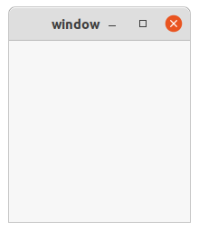

## installation

```
apt install glade
apt install libgtk-3-dev
```

安装glade设计工具，安装gtk开发包（头文件，pkgconfig的配置文件）。

## hello world

```c
#include <gtk/gtk.h>
  
static void activate(GtkApplication* app, gpointer user_data) {
        GtkWidget* window;

        window = gtk_application_window_new(app);
        gtk_window_set_title(GTK_WINDOW(window), "window");
        gtk_window_set_default_size(GTK_WINDOW(window), 200, 200);
        gtk_widget_show_all(window);
}

int main(int argc, char** argv) {
        GtkApplication *app;
        int status;

        app = gtk_application_new("org.gtk.example", G_APPLICATION_FLAGS_NONE);
        g_signal_connect(app, "activate", G_CALLBACK(activate), NULL);
        status = g_application_run(G_APPLICATION(app), argc, argv);
        g_object_unref(app);
        return status;
}

```

glade设计最简单的窗口。

```shell
pkg-config --cflags gtk+-3.0
```

获取编译选项

```shell
pkg-config --libs gtk+-3.0
```

获取链接库

```shell
g++ `pkg-config --cflags gtk+-3.0` main.c `pkg-config --libs gtk+-3.0` -rdynamic -o main
```

## 运行



