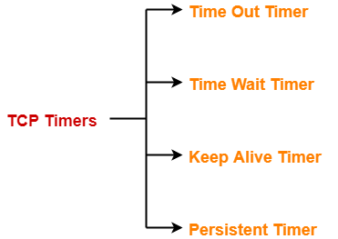

## 从一个tcp窗口探测差一问题的patch看TCP协议中的使用的定时器

这个[patch](https://git.kernel.org/pub/scm/linux/kernel/git/torvalds/linux.git/commit/net/ipv4/tcp_timer.c?id=3976535af0cb9fe34a55f2ffb8d7e6b39a2f8188)的描述如下:

> Previously there is an off-by-one bug on determining when to abort
> a stalled window-probing socket. This patch fixes that so it is
> consistent with tcp_write_timeout().

从描述看关于何时中止执行窗口探测的socket的。下面从协议规范中寻找定时器使用。

## TCP协议中的timer 


协议中主要有4个定时器，注意这里每个TCP连接都有4个定时器。

1. Time Out Timer
   > TCP uses a time out timer for retransmission of lost segments.
2. Time Wait Timer
   > TCP uses a time wait timer during connection termination.
3. Keep Alive Timer
   > TCP uses a keep alive timer to prevent long idle TCP connections.
4. Persistent Timer
   > TCP uses a persistent timer to deal with a zero-widow-size deadlock situation.
   > It keeps the window size information flowing even if the other end closes its receiver window.

从patch的描述看主要涉及窗口探测，即Persistent Timer。

### Persistent Timer的作用
 
Consider the following situation:

1. Sender receives an acknowledgment from the receiver with zero window size.
2. This indicates the sender to wait.
3. Later, receiver updates the window size and and sends the segment with the update to the sender.
4. This segment gets lost.
5. Now, both sender and receiver keeps waiting for each other to do something. To deal with such a situation, TCP uses a persistent timer.

发送测收到zero-window-size的ack报文后，发送测不能再发送报文，等待后续接收测更新窗口大小报文通知。为了防止该通知消息被丢的情况，使用
persistent timer，发送测会周期性的窗口探测报文消息，接收测回应该窗口探测消息。如果窗口大小为0，则继续窗口探测过程；非零则恢复数据传输过程。

接下来分析下在linux内核中TCP协议栈所使用的定时器。

## linux内核中的timer

在linux内核中每条tcp连接使用一个inet_connection_sock的结构描述。
```
struct inet_connection_sock {
	struct inet_sock {
		struct sock {
			struct timer_list	sk_timer; //(1) keepalive timer
		}
	}
 	struct timer_list	  icsk_retransmit_timer; //(2) time out timer
 	struct timer_list	  icsk_delack_timer; //(3) delay ack timer
}
```

### sk_timer

sk_timer作为keepalive timer使用，在socket设置SOCK_KEEPOPEN时才启用。

keepalive timer流程如下:

```
server               client
            ->syn   \
			<-synack| 3 handshakes
			->ack   /
			
			2 hours (keepalive timer timeout)
			-->probe \
			         |=> 9 times (9*75s) 
			-->probe /
			
			terminate
```			

linux内核对keepalive的处理代码如下:

```
static void tcp_keepalive_timer (struct timer_list *t)
	...
	if (elapsed >= keepalive_time_when(tp)) { // 7200s
			/* If the TCP_USER_TIMEOUT option is enabled, use that
			 * to determine when to timeout instead.
			 */
			if ((icsk->icsk_user_timeout != 0 &&
				elapsed >= msecs_to_jiffies(icsk->icsk_user_timeout) &&
				icsk->icsk_probes_out > 0) ||
				(icsk->icsk_user_timeout == 0 &&
				icsk->icsk_probes_out >= keepalive_probes(tp))) { //到达次数限制9
					tcp_send_active_reset(sk, GFP_ATOMIC);
					tcp_write_err(sk);
					goto out;
			}
			if (tcp_write_wakeup(sk, LINUX_MIB_TCPKEEPALIVE) <= 0) { //发送probe报文
					icsk->icsk_probes_out++;
					elapsed = keepalive_intvl_when(tp);// 75s
			} else {
					/* If keepalive was lost due to local congestion,
					 * try harder.
					 */
					elapsed = TCP_RESOURCE_PROBE_INTERVAL;
			}
	} else {
			/* It is tp->rcv_tstamp + keepalive_time_when(tp) */
			elapsed = keepalive_time_when(tp) - elapsed;
	}
	...
```

在上面代码中使用**icsk_probes_out**对probe次数进行统计。keepalive_probes缺省设置为9。

```
net.ipv4.tcp_keepalive_probes = 9
```

使用上面的内核选项可以设置该值。

tcp_write_wakeup负责发出probe报文，这个函数首先判断socket发送队列是否
有报文等待发送，如果有则发送sk->sk_send_head报文(注意这个指针总是指向下一个要
发送的报文)；如果发送队列空则发送probe报文(注意这个报文的序列号为out of date即无效)。

如果报文能够到达接收测，则接收测回复ack消息。下面是收到ack报文的处理流程:
```
static void tcp_ack_probe(struct sock *sk)
{
        struct inet_connection_sock *icsk = inet_csk(sk);
        struct sk_buff *head = tcp_send_head(sk);
        const struct tcp_sock *tp = tcp_sk(sk);

        /* Was it a usable window open? */
        if (!head)
                return;
        if (!after(TCP_SKB_CB(head)->end_seq, tcp_wnd_end(tp))) { // normal window size
                icsk->icsk_backoff = 0;
                inet_csk_clear_xmit_timer(sk, ICSK_TIME_PROBE0);
                /* Socket must be waked up by subsequent tcp_data_snd_check().
                 * This function is not for random using!
                 */
        } else { // zero-window-size
                unsigned long when = tcp_probe0_when(sk, TCP_RTO_MAX);

                tcp_reset_xmit_timer(sk, ICSK_TIME_PROBE0,
                                     when, TCP_RTO_MAX, NULL);
        }
}
```

如果接收测返回报文通知窗口大小为0则继续窗口探测过程，由于有接收到报文，
这时keepalive超时时判断距离上次报文时间不会超过7200s，这样keepalive定时器
重置为7200s超时。

如果报文无法到达接收测，keepalive在75秒后超时，重新发送probe报文直到到达内核设置的
tcp_keepalive_probes次后终止该tcp连接。

linux内核使用**icsk_probes_out**统计keepalive的探测次数和zero-window-size的探测次数。考虑下面的
一种情况：
keepalive定时器超时了3次后，才从接收测收到ack消息，这时开始窗口探测过程，这里并没有对**icsk_probes_out**
清零，而是继续增加**icsk_probes_out**次数，这样处理有意简化窗口探测的过程。

## icsk_retransmit_timer

即重传定时器，对应协议中的Time Out Timer和Persistent Timer。
内核使用一个定时器处理重传定时器和zero-window-size的探测定时器使用。	

```
net.ipv4.tcp_retries2 = 15
```
内核设置重传次数和zero-window-size次数限制为上面的值。

```
server               client
            ->syn
			<-synack
			->ack
			...
			<--zero window ack
			
			-->probe \
			...       |=> 15 times (15* [rto])
			-->probe /
```

```		
server               client
            ->syn
			<-synack
			->ack
			...
            -->data (not acked by receiver)
            -->probe \
			...      |=> 15 times (15* [rto])
			-->probe /
```

### icsk_delack_timer
待

## 参考
1. [tcp协议中的timer](https://www.gatevidyalay.com/tcp-timers-transmission-control-protocol/)
2. [kernel source](https://git.kernel.org/pub/scm/linux/kernel/git/torvalds/linux.git/tree/)