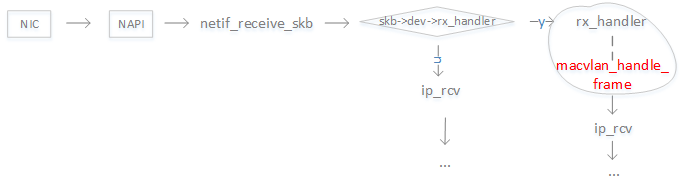
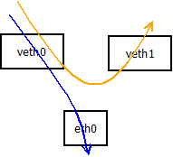

OpenWrt是一个嵌入式的 Linux 发行版， 拥有强大的网络组件和扩展性，
常常被用于工控设备、电话、小型机器人、智能家居、路由器以及VOIP设备中。

很多采用openwrt的软路由的人更多的是使用openwrt的多拨实现带宽叠加。
其实openwrt多拨是基于内核的macvlan模块。

## macvlan是什么？

在macvlan之前，我们只能为一个物理网络接口添加多个ip地址，却不能添
加多个mac地址。macvlan可以在一个物理网络接口上虚拟出多个虚拟网络
接口，每个虚拟接口可以独立配置mac和ip地址。这样物理网络接口相当于
实现了一个交换机，记录了mac和虚拟接口的对应关系。

### macvlan收包处理流程

上图为内核的收包处理流程。内核为设置了macvlan的物理网络接口设置rx_handler函数，
在使用NAPI机制收到报文上送协议栈之前先执行macvlan_handle_frame。

macvlan_handle_frame函数根据二层头的目的mac地址判断是发给物理网络接口还是先发
给虚拟网络接口。设置skb->dev为macvlan设备，然后报文进入ip协议栈处理流程。

### maclavn发包流程

macvlan_queue_xmit是macvlan设备的发包函数，判断如果是桥模式则根据目的mac查找是否
是本机macvlan设备，如果是则直接发给本机macvlan设备执行netif_rx_internal。否则报文
通过底层设备发送出去。

## 总结

有个macvlan，我们就可以基于虚拟网络接口进行pppoe拨号，从而获取多个wan连接，实现多拨。

## 扩展阅读
1. [macvlan and ipvlan](https://sreeninet.wordpress.com/2016/05/29/macvlan-and-ipvlan/)
2. [bridge vs macvlan](http://hicu.be/bridge-vs-macvlan)