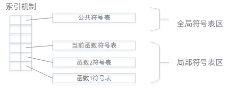
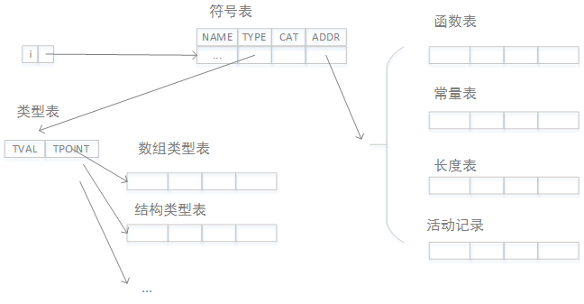
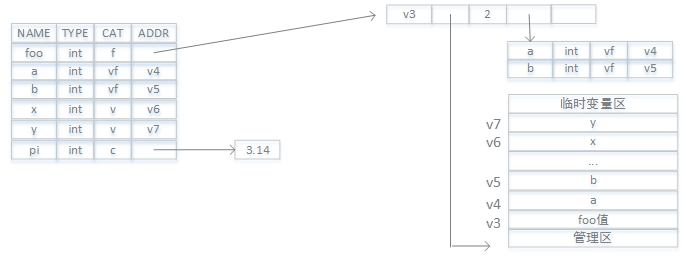

看完编译器领域的"龙书"，有必要对某些关键点做下总结。符号表穿插在整个编译的过程，
无意是最重要的组成部分。

## 符号表？

标识符的动态语义词典，贯穿编译的整个阶段，在编译的过程中不断更新。
类似人口大普查一样，把每个人信息都录入某个系统中，在需要时再查询。

## 符号表内容

1. 名字 
> 标识符，用作查询关键字
```
int a;
int foo(int a,int b)
{
 int c = a+b;
 return c;
}
```

2. 类型 
> 该标识符的数据类型及其相关信息
```
int a;
int foo(int a,int b)
{
 int c = a+b;
 return c;
}
```
a，b，c是整数类型，foo是函数类型。

3. 种类 
> 该标识符在源程序的语义角色
```
int a;(1)
int foo(int a,int b)(2)
{
 int c = a+b;(3)
 return c;(4)
}
```
(1)中a是变量
(2)中foo是函数，a和b是形参
(3)中c是变量

4. 地址
> 与值单元相关的一些信息

## 符号表作用

- 变量定义和重定义检查
- 类型匹配检查
- 数据越界和溢出检查
- 值单元存储分配信息
- 函数参数传递和校验

## 符号表组织和管理

- 遇到说明性标识符则插入符号表并把语义信息插入表项中，使其指向相应表项
- 遇到应用性标识符则查询符号表，使其指向相应表项

## 符号表查询和访问方式

- 线性表  
- 顺序表 
- 索引表 
- 散列表

## 符号表的管理和维护

一个源文件有若干函数组成，通常每个函数对应一个符号表，此外还有一个公共符号表。

符号表如何管理取决于所属语言的程序结构，常见的实现方式是在内存设定一定长度的
符号表区，并建立适当的索引机制，访问相应的符号表。

如下图所示：


## 符号表的结构设计
```
int foo(int a,int b)
{
	int x,y;
	const pi=3.14;
	x = a*a;  y = b*b;
	retrun pixy;
}
```
需要填入符号表的标识符：
|标识符|语义属性|
|-----|:-------|
| foo | 函数，附加信息：类型，参数情况和入口地址|
| a   | 形参 |
| b   | 形参 |
| x   | 变量 |
| y   | 变量 |
| pi  | 常量 |

由于标识符种类不同，导致语义属性不尽相同

## 如何组织符号表？

下面是“龙书”中提到的一种符号表的体系结构：


说明：
|-----|-------------------|
|NAME |	标识符源码，内部码|
|TYPE | 指针，指向类型表的表项|
|CAT  | 种类编码：函数f，变量v，类型t，常量c，传值形参vf，传地址形参vn|
|ADDR | 指针，根据标识符种类不同，指向函数表，常量表等|

- 类型表
|------|----|
|TVAL  |类型编码：整型，浮点型，字符型，布尔型，数组型，结构型|
|TPOINT|指针，根据类型编码的不同，指向不同的信息表项 基本类型：空 数组类型：指向数组表项 结构类型：指向结构表项|

- 数组表
|----|-------|
|LOW|	数组下届|
|UP	|数组上届|
|CTP|	成员类型指针，指向类型表中表项|
|CTLEN|	成员类型长度，成员类型所占值单元长度|

- 函数表
|----|----------------|
|OFF|函数的值单元地址|
|DAT|指针，指向函数的数据区|
|FN|参数个数|
|PAR|指针，指向形参表|
|ENT|函数运行首地址，运行时填写|

- 其它表

 - 常量表存放常量的初值
 - 长度表存放数据类型所占值单元的长度

- 活动记录表
一个函数虚拟的值单元存储分配表，在函数运行调用时用到故称活动记录。

## 符号表例子
```
int foo(int a,int b)
{
	int x,y;
	const pi=3.14;
	x = a*a;  y = b*b;
	retrun pixy;
}
```

该函数经过语法分析后，填充如下的信息:


