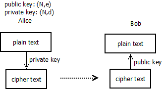
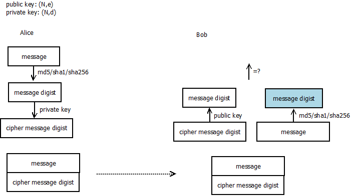

## 问题

最近有个需求是关于签名，这里借此对非对称加密和签名机制了解一下。

## 简介

RSA是一种重要的非对称加密算法，应用非常广泛。

关于RSA的介绍可以参考[wiki](https://zh.wikipedia.org/wiki/RSA%E5%8A%A0%E5%AF%86%E6%BC%94%E7%AE%97%E6%B3%95)。

RSA算法基于大素数整数无法执行因子分解的，目前推荐的长度至少1024。

## 加密
这里以简单的示意图说明：



## 签名



如果遇到中间人攻击修改了消息内容，Bob对消息执行md5/sha1/sha256时得到的digist和解密得到的digist不同，从而知道消息被篡改。

## openssl应用
```
openssl genrsa -out my.key 1024
```
以上生成rsa私钥文件，注意这里时私钥文件，并不是说rsa私钥。rsa私钥文件有自己的格式，从里边内容可以推导出rsa私钥和rsa公钥。
关于rsa私钥文件格式参考[这里](https://www.shangyang.me/2017/05/24/encrypt-rsa-keyformat/)。

## 使用openssl的python接口编程
```
# -*- coding: utf-8 -*-

"""
Certificate generation module.
"""

from OpenSSL import crypto

TYPE_RSA = crypto.TYPE_RSA
TYPE_DSA = crypto.TYPE_DSA

def createKeyPair(type, bits):
    """
    Create a public/private key pair.
    Arguments: type - Key type, must be one of TYPE_RSA and TYPE_DSA
               bits - Number of bits to use in the key
    Returns:   The public/private key pair in a PKey object
    """
    pkey = crypto.PKey()
    pkey.generate_key(type, bits)
    return pkey

def createCertRequest(pkey, digest="md5", **name):
    """
    Create a certificate request.
    Arguments: pkey   - The key to associate with the request
               digest - Digestion method to use for signing, default is md5
               **name - The name of the subject of the request, possible
                        arguments are:
                          C     - Country name
                          ST    - State or province name
                          L     - Locality name
                          O     - Organization name
                          OU    - Organizational unit name
                          CN    - Common name
                          emailAddress - E-mail address
    Returns:   The certificate request in an X509Req object
    """
    req = crypto.X509Req()
    subj = req.get_subject()

    for (key,value) in name.items():
        setattr(subj, key, value)

    req.set_pubkey(pkey)
    req.sign(pkey, digest)
    return req

def createCertificate(req, (issuerCert, issuerKey), serial, (notBefore, notAfter), digest="md5"):
    """
    Generate a certificate given a certificate request.
    Arguments: req        - Certificate reqeust to use
               issuerCert - The certificate of the issuer
               issuerKey  - The private key of the issuer
               serial     - Serial number for the certificate
               notBefore  - Timestamp (relative to now) when the certificate
                            starts being valid
               notAfter   - Timestamp (relative to now) when the certificate
                            stops being valid
               digest     - Digest method to use for signing, default is md5
    Returns:   The signed certificate in an X509 object
    """
    cert = crypto.X509()
    cert.set_serial_number(serial)
    cert.gmtime_adj_notBefore(notBefore)
    cert.gmtime_adj_notAfter(notAfter)
    cert.set_issuer(issuerCert.get_subject())
    cert.set_subject(req.get_subject())
    cert.set_pubkey(req.get_pubkey())
    cert.sign(issuerKey, digest)
	return cert

cakey = createKeyPair(TYPE_RSA, 1024)
careq = createCertRequest(cakey, CN='Certificate Authority')
cacert = createCertificate(careq, (careq, cakey), 0, (0, 60*60*24*365*5)) # five years
open('simple/CA.pkey', 'w').write(crypto.dump_privatekey(crypto.FILETYPE_PEM, cakey))
open('simple/CA.cert', 'w').write(crypto.dump_certificate(crypto.FILETYPE_PEM, cacert))
for (fname, cname) in [('client', 'Simple Client'), ('server', 'Simple Server')]:
    pkey = createKeyPair(TYPE_RSA, 1024)
    req = createCertRequest(pkey, CN=cname)
    cert = createCertificate(req, (cacert, cakey), 1, (0, 60*60*24*365*5)) # five years
    open('simple/%s.pkey' % (fname,), 'w').write(crypto.dump_privatekey(crypto.FILETYPE_PEM, pkey))
    open('simple/%s.cert' % (fname,), 'w').write(crypto.dump_certificate(crypto.FILETYPE_PEM, cert))

```

## 总结

对签名的简单理解：
1. 关于自签名证书，使用自己的私钥对证书签名。证书有很多内容，如有效期和commonName。

2. 正常使用是通过可信的第三方CA机构签发证书，然后把私钥文件和证书文件发给客户。

3. 注意私钥文件可以推导出公钥和私钥信息。证书文件中包含公钥信息，通过得到公钥信息就可以和客户安全通信。

